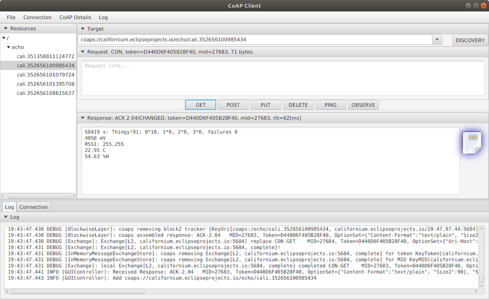

## Zephyr - Coaps Demo Client with TinyDtls

# Cf-Browser

If you want to check, what the server has received, download the [cf-browser-3.5.0](https://repo.eclipse.org/content/repositories/californium-releases/org/eclipse/californium/cf-browser/3.5.0/cf-browser-3.5.0.jar). It requires to install a java runtime and javafx, please refer to [github - cf-browser](https://github.com/eclipse/californium.tools/tree/main/cf-browser).

Cf-browser is a simple client tool to demonstrate CoAP.

```
java --module-path /usr/share/openjfx/lib --add-modules javafx.controls,javafx.fxml -jar cf-browser-3.5.0.jar coaps://californium.eclipseprojects.io/echo
```

(Start for Ubuntu using java 11.)



Press the "GET" button to read the list of available devices. Then select your device by the IMEI (label on the `Thingy:91` under the orange cover) and press the "GET" button again. The cf-browser response window shows the last sent request of your device.
If you press the "N" button on the Thingy:91 again, and then the "GET" button again, the displayed text is modified slightly. Press the "OBSERVE" button and you will see the update automatically, if you press the "N" button on the `Thingy:91` again.

The cf-browser is a tool to easily explore coap, but it's not a intended application.