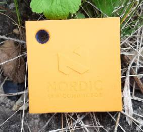

# Zephyr - Coaps Demo Client with Eclipse/TinyDtls

This [zephyr](https://www.zephyrproject.org/) client demonstrates to use coaps ([CoAP](https://tools.ietf.org/html/rfc7252) over [DTLS 1.2](https://tools.ietf.org/html/rfc6347)) with the [Eclipse/TinyDtls Library](https://github.com/eclipse/tinydtls). In combination with [Eclipse/Californium](https://github.com/eclipse/californium) it enables a device to use [DTLS 1.2 Connection ID](https://tools.ietf.org/html/rfc9146) for 

- reliable, 
- efficient, and 
- end-to-end encrypted

mobile device communication (LTE-M, NB-IoT), up to a few hundred bytes. Together, CoAP / DTLS CID and LTE-M/NB-IoT, enables to build mobile applications with 

- zero-install and 
- high cost-efficiency.

The demo client itself is in early development stage. In "good weather", the `Thingy:91` flies from battery for 4 weeks. In "storm" it may require the be switched off and on again. That should be rare exceptions. With version 0.2 the main cause of longer periods of lost connectivity to the mobile network is fixed.

The demo client is intended as groundwork for your own ideas. "Out-of-the-box" this application is only useful to easily check, if mobile IoT works at the locations and environment you want to use it. To build products and applications on this protocol stack requires to implement a production client and to adapt the coap-server for your function. The demo targets therefore people, which are already common with [zephyr](https://www.zephyrproject.org/), or, even better, common with the development for the [Thingy:91](https://www.nordicsemi.com/Products/Development-hardware/Nordic-Thingy-91) itself.
Without that knowledge it will be hard an time consuming to make benefit out of this demo.

## Supported Devices

| For now, only the<br/> [Nordic Semiconductor Thingy:91](https://www.nordicsemi.com/Products/Development-hardware/Nordic-Thingy-91)<br/> is supported. |  |
| :- | - |

Maybe other modems and devices gets supported over the time as well.

## Required HW-Tools for Thingy:91

In order to use this demo with your `Thingy:91`, you need:

- a `Thingy:91` (maybe better two ;-)).
- the `Thingy:91` is usually shipped with a SIM card. Check, if that covers your [area/country](https://www.nordicsemi.com/-/media/Software-and-other-downloads/3rd-party/iBasis-simplified-coverage-map-for-web.pdf). If not, you need a SIM card for your area/country. (Sometimes the `Thingy:91` is shipped with an expired SIM card. Then you will need also an other one.)
- a debug probe to flash the device.
   - either a [nRF9160-DK](https://www.nordicsemi.com/Products/Development-hardware/nRF9160-DK) and a [10-wire-ribbon connector, 2x5, 0.050"](https://www.digikey.com/en/products/detail/harwin-inc/M50-9100542/4953091).
   - or a [j-Link](https://www.segger.com/products/debug-probes/j-link/) and a [cortex-M adapter](https://www.segger.com/products/debug-probes/j-link/accessories/adapters/9-pin-cortex-m-adapter/).

## Run It - Fast Track

It's not recommended, but you may start with using a pre-build firmware binary. Usually that will take about 1h to send a first message with your `Thingy:91`.

[Fast Track](./FASTTRACK.md)

## Build

In order to be able to build the demo-client, you need to install the development environment. That will take up to an afternoon to send your a message with your `Thingy:91`.

### Install Tools and Tool-Chains

Basically, this requires to follow [Developing with Zephyr](https://docs.zephyrproject.org/latest/develop/index.html).
Though for now only the [Nordic Semiconductor Thingy:91](https://www.nordicsemi.com/Products/Development-hardware/Nordic-Thingy-91) is supported, it may be also good to go through [Getting started with Thingy:91](https://developer.nordicsemi.com/nRF_Connect_SDK/doc/latest/nrf/ug_thingy91_gsg.html) additionally.

Please check the proper installation of your tools building some of the provided samples there (e.g. [zephyr/samples/basic/blinky](https://github.com/zephyrproject-rtos/zephyr/tree/main/samples/basic/blinky) or/and [nrf/samples/nrf9160/udp](https://github.com/nrfconnect/sdk-nrf/tree/main/samples/nrf9160/udp)).

### Download the Sources

This demo comes with a [west.yml](./west.yml) description. Download the demo:

```sh
west init --mr main -m https://github.com/boaks/zephyr-coaps-client.git zephyr-coaps-client
```

> **Note:** 
Please obey the `--mr main`.
Otherwise it will fail fetching the non existing "master" branch!

That creates a `zephyr-coaps-client` folder and you need to populate it further:

```sh
cd zephyr-coaps-client
west update 
```

That takes a while (couple of minutes). It downloads zephyr, the Nordic Semiconductor SDK and the tinydlts zephyr module.

Currently the demo uses the [zephyr-cid-develop](https://github.com/boaks/tinydtls/tree/zephyr_cid_develop) branch of my tinydtls fork. This is only intended for temporary convenience because currently many PRs are pending at the [eclipse repo](https://github.com/eclipse/tinydtls) and it will take some time to get them merged into "develop" or "main" there. When done, this demo will be switched to that [eclipse repo](https://github.com/eclipse/tinydtls).

### Build & Flash

After `west` completes the update, build the firmware:
Change the current directory to "zephyr-coaps-client/coaps-client".

```sh
cd coaps-client
west build -b thingy91_nrf9160_ns
```

and then flash that resulting firmware to your device

```sh
west flash
```

See also [Updating Firmware Through External Debug Probe](https://developer.nordicsemi.com/nRF_Connect_SDK/doc/latest/nrf/ug_thingy91_gsg.html#updating-firmware-through-external-debug-probe).

## Run It

After flashing, the `Thingy:91` starts to blink slow (purple) and after attaching to the mobile-network it switches to green. If the LED is switched off, the device is also connected with the plugtest-server of the [Eclipse/Californium Sandbox](https://github.com/eclipse/californium#interop-server).

Press the `Thingy:91`'s call-button (the symbolic "N" in the center of the orange cover). The LED should start with blue and changes very fast to lightblue. If it is re-attached at the mobile-network, it switches to green. And if the response from the server is received, the LED switches off again. On error, the LED is switched to red. Usually it takes all together 1 second (LTE-M/CAT-M1) and only 2 ip-messages are exchanged.

Done.

The demo client exchanges encrypted messages with the coap-server. These messages are only for demonstration, the data is considered to be replaced by your own ideas.

Demo message:

```
41 s, Thingy:91 v0.2, 0*3, 1*0, 2*0, 3*0, failures 0
4015 mV
RSSI: 23,35
24.83 C
53.16 %H
```

It starts with the up-time in seconds in the first line, followed by the label "Thingy:91" and a sent statistic. "`0*3`" := 3 exchanges without retransmission, "`1*0`" := no (0) exchanges with 1 retransmission. The current exchange is not included in this statistic. The second line contains the battery voltage and the third the receiving signal strength. If the sensors are enabled (default), the temperature and humidity is also appended.

The demo uses the "echo" resource of the plugtest-server, therefore the response contains just the same message.

If you want to see, what your `Thingy:91` has sent to the server, see [cf-browser](./CFBROWSER.md).

## Next Steps

As mentioned at the introduction, the demo is intended as groundwork for your own ideas. 

[Next Steps](./NEXTSTEPS.md)  

## Licenses

This demo itself is licensed under [EPL-2.0](./licenses/EPL-2.0.txt).

Some files are used especially for the `Thingy:91` and are licensed under [Nordic-5](./licenses/Nordic-5.txt). This files are only licensed to be used with Nordic Semiconductor devices.
See [boards](./boards), [child_image](./child_image), and [ext_sensors](./src/ext_sensors).

The demo uses several third-party content, please refer to [NOTICE](NOTICE.md) for details.
