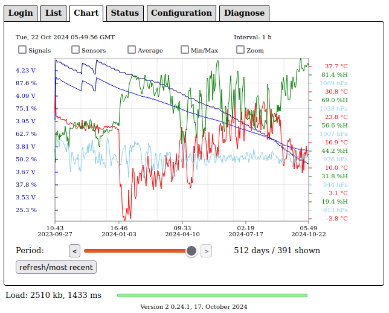
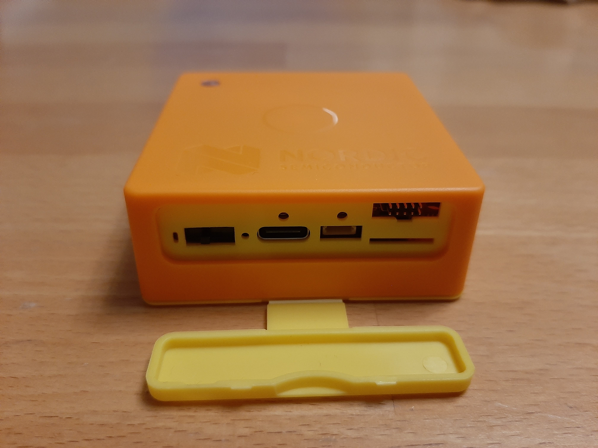
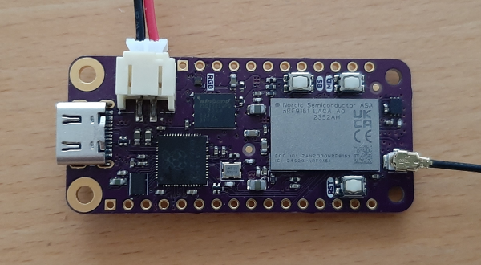

# Zephyr - Coaps Demo Client with Eclipse/TinyDtls

## Reliable - Efficient - Encrypted

Version 0.10.0 - August 2024

This [zephyr](https://www.zephyrproject.org/) client demonstrates to use coaps ([CoAP](https://tools.ietf.org/html/rfc7252) over [DTLS 1.2](https://tools.ietf.org/html/rfc6347)) with the [Eclipse/TinyDtls Library](https://github.com/eclipse/tinydtls). In combination with [Eclipse/Californium](https://github.com/eclipse/californium) as Cloud-Server, it enables a device to use [DTLS 1.2 Connection ID](https://tools.ietf.org/html/rfc9146), which obsolete the commonly used frequently DTLS handshakes and eliminates that expensive overhead.
Reducing the messages exchange mostly down to two ip-messages (one request, one response), it enables your device for

- **reliable**, 
- **efficient**, and 
- **end-to-end encrypted**

communication for messages up to a few hundred bytes.
In combination with cellular LTE-M/NB-IoT technolopy, CoAP / DTLS 1.2 CID enables to build mobile applications with 

- zero-install and 
- high cost-efficiency.

The demo client itself is in development stage. In "good and normal weather", the `Thingy:91` runs from battery for 7-15 months, exchanging every hour a message. In "storm" it may require to be switched off and on again in very rare exceptions.

**The first device reached 256 days update and uncovered a bug displaying an uptime larger than 256 days! Demonstrates both, reliability and efficiency.**



```
1-09:24:01 [d-hh:mm:ss], Thingy:91 v0.9.0+0, 0*6146, 1*29, 2*2, 3*0, failures 4
!3789 mV 48% (241 days left) battery
!CE: down: 8, up: 1, RSRP: -95 dBm, CINR: 10 dB, SNR: 11 dB
```

- 257 days, about 6150 messages, some retransmissions, 1%% failures.
- 48% battery left
- quite good signal conditions.

The demo client is intended as groundwork for your own ideas. "Out-of-the-box" this application is useful to easily check, if cellular IoT works at the locations and environment you want to use it. The demo reports also some details about the cellular network functions. 
To build products and applications on this protocol stack requires to implement a production client and to adapt the coap-server for your function. The demo targets therefore people, which are already common with [zephyr](https://www.zephyrproject.org/), or, even better, common with the development for the [Thingy:91](https://www.nordicsemi.com/Products/Development-hardware/Nordic-Thingy-91) itself.
Without that knowledge it will be time consuming to make benefit out of this demo.

**Note:**
The demo client is considered to use CoAP/DTLS 1.2 CID. Without server-side support for DTLS 1.2 CID, it will not work proper. Please ensure, that your server supports that.

## Supported Devices

For now, only [nRF9160](https://www.nordicsemi.com/products/nrf9160) and [nRF9161](https://www.nordicsemi.com/products/nrf9161) based devices are supported.

| Device | Image |
| :- | - |
| [Nordic Semiconductor, Thingy:91](https://www.nordicsemi.com/Products/Development-hardware/Nordic-Thingy-91)<br>Works "out-of-the-box" in the "wild". Comes with selection of sensors (environment, motion) and a 2KB EEPROM. Not easy to extend with custom sensors. | [](./docu/thingy91.jpg) |
| [Circuit Dojo, nRF9160 feather v5](https://www.jaredwolff.com/store/nrf9160-feather/)<br>Requires additional batteries, antennas, and closures to work in the "wild". Comes with motion sensor and 4MB flash. The design of the feather allows to easily add custom sensors. | [](https://docs.jaredwolff.com/img/nrf9160-feather-v4-nobg.jpg) |
| [Nordic Semiconductor, nRF9160 DK](https://www.nordicsemi.com/Products/Development-hardware/nRF9160-DK)<br>Works "out-of-the-box" on the desk. Comes with a 8MB flash. The design allows to easily add custom sensors. | [](https://www.nordicsemi.com/-/media/Images/Products/DevKits/nRF91-Series/nRF9160-DK/nRF9160-DK.png) |
| [Nordic Semiconductor, nRF9161 DK](https://www.nordicsemi.com/Products/Development-hardware/nRF9161-DK)<br>Works "out-of-the-box" on the desk. Comes with a 32MB flash. The design allows to easily add custom sensors. | [](https://www.nordicsemi.com/-/media/Images/Products/DevKits/nRF91-Series/nRF9161-DK/nRF9161_DK_Perspective-small.png) |
| [Nordic Semiconductor, nRF9151 DK](https://www.nordicsemi.com/Products/Development-hardware/nRF9151-DK)<br>Works "out-of-the-box" on the desk. Comes with a 32MB flash. The design allows to easily add custom sensors. | [](https://www.nordicsemi.com/-/media/Images/Products/DevKits/nRF91-Series/nRF9151-DK/get-started-nRF9151-DK/nRF9151-get-started.png) |
| [Nordic Semiconductor, Thingy:91X](https://www.nordicsemi.com/Products/Development-hardware/Nordic-Thingy-91-X)<br>Works "out-of-the-box" in the "wild". Comes with selection of sensors (environment, motion) and a 32MB flash. A QWIIC connector enables to add custom sensors. | [](./docu/thingy91x.jpg) |
                                             
The demo works with [ncs-2.6.4](https://github.com/nrfconnect/sdk-nrf/tree/v2.6.4).

To benefit from the newer modem features, please consider to use the modem firmware [1.3.7](https://www.nordicsemi.com/-/media/Software-and-other-downloads/Dev-Kits/nRF9160-DK/nRF9160-modem-FW/mfw_nrf9160_1.3.7.zip) for `nRF9160` based device. See ["Getting started with Thingy:91"](#install-tools-and-tool-chains) below how to apply it.

For `nRF9161` and `nRF9151` devices use the modem firmware [2.0.2](https://nsscprodmedia.blob.core.windows.net/prod/software-and-other-downloads/sip/nrf91x1-sip/nrf91x1-lte-modem-firmware/mfw_nrf91x1_2.0.2.zip) for that. 

`NCS 2.7.0` nor `NCS 2.8.0` is not supported. For experimental support of `NCS 2.9.1` see branch `NCS_2_9_x`.

## Supported New/Upcoming Devices

The demo supports two new upcoming devices based on the nRF9161.

| Device | Image |
| :- | - |
| [Circuit Dojo, nRF9161 feather](https://community.circuitdojo.com/d/480-nrf9160-feather-suggestions-for-next-version/64)<br>Requires additional batteries, antennas, and closures to work in the "wild". Comes with 2-channel USB, onboard OCD, motion sensor, a 16MB flash and a Qwiic connector. | [](./docu/nRF9161-feather.png) |
| [Conexio Stratus Pro nRF9161](https://conexiotech.com/conexio-stratus-pro-nrf9161/)<br>Requires additional batteries, antennas, and closures to work in the "wild". Comes with built-in solar energy harvesting, motion sensor, 2KB EEPROM, and 2x5 plug for JTAG. Includes a SIM card with 500MB in 10 years. | [](https://conexiotech.com/wp-content/uploads/2024/02/D-copy.png) |

The demo supports also new upcoming devices based on the nRF9151.

| Device | Image |
| :- | - |
| [Conexio Stratus Pro nRF9151](https://conexiotech.com/conexio-stratus-pro-nrf9151/)<br>Requires additional batteries, antennas, and closures to work in the "wild". Comes with built-in solar energy harvesting, motion sensor, 2KB EEPROM, and 2x5 plug for JTAG. Includes a SIM card with 500MB in 10 years. | [](https://conexiotech.com/wp-content/uploads/2024/10/stratus-pro-transparency-1-1536x911.png) |
| [Makerdiary nRF9151 Connect Kit](https://makerdiary.com/products/nrf9151-connectkit/)<br>Requires additional batteries and closures to work in the "wild". Comes with onboard OCD. | [](https://github.com/makerdiary/nrf9151-connectkit/blob/main/docs/assets/images/attaching_lte_antenna.png) |

**Note:** for all supported new boards you need to copy the board definitions in folder `extra` into the destination folders. The manufacturer of the boards already announced to offer support for NCS 2.7.0 and newer, so the full support will only come with NCS 2.7.0. 

See [extras/README](./extras/README.md) for more information.

## More Devices

Maybe other modems and devices gets supported over the time as well. For some of the nRF9160 based devices porting should not be too hard.

| Candidate | Image |
| :- | - |
| [Sparkfun Thing Plus nRF9160](https://www.sparkfun.com/products/17354?utm_source=sendfox&utm_medium=email&utm_campaign=nrf9160-thing-plus)<br>Qwiic and 2x5 plug for JTAG. | [](https://cdn.sparkfun.com//assets/parts/1/6/3/6/0/17354-SparkFun_Thing_Plus_-_nRF9160-01.jpg) |
| [Icarus IoT Board v2](https://www.actinius.com/icarus)<br>Includes a eSIM.| [](https://www.actinius.com/images/Icarus_without_shadow_ff07ad69e4.png) |
| [Conexio Stratus](https://www.crowdsupply.com/conexio/stratus)<br>With built-in solar energy harvesting. Includes a SIM card with 500MB in 10 years. | [](https://www.crowdsupply.com/img/9c62/side.png) |
| [Fanstel LN60E](https://www.fanstel.com/buy/bt840f-v1-nrf52840-bluetooth-5-thread-zigbee-module-by45z-8ypje)<br>Reduced to the minimum. Unfortunately the current version uses a LDO with 50µA quiescent current.| [](https://images.squarespace-cdn.com/content/v1/561459a2e4b0b39f5cefa12e/1600900228634-0AGSVRBYZKC1MD9Q5YDA/LN60E.png) |
| [MIKROE LTE IoT 4 Click](https://www.mikroe.com/lte-iot-4-click)<br>Even less, but with power LED. If you want to use it, remove the LED or cut the connects to the ground-plane next the LED. The device has no analogue gpio available at the header. | [](https://cdn1-shop.mikroe.com/img/product/lte-iot-4-click/lte-iot-4-click-large_default-1.jpg) |


## Required HW-Tools for Thingy:91

In order to use this demo with a `Thingy:91`, you need:

- a `Thingy:91` (maybe better two ;-)).
- the `Thingy:91` is usually shipped with a SIM card. Check, if that covers your [area/country](https://www.nordicsemi.com/-/media/Software-and-other-downloads/3rd-party/iBasis-simplified-coverage-map-for-web.pdf). If not, you need a SIM card for your area/country. (Sometimes the `Thingy:91` is shipped with an expired SIM card. Then you will need also an other one.)
- a debug probe to flash the device.
   - either a [nRF9160-DK](https://www.nordicsemi.com/Products/Development-hardware/nRF9160-DK) and a `10-wire-ribbon connector, 2x5, 0.050"` from [Harwin Inc.](https://www.digikey.com/en/products/detail/harwin-inc/M50-9100542/4953091) or [Adafruit Industries LLC](https://www.digikey.de/de/products/detail/adafruit-industries-llc/1675/6827142).
   - or a [Segger j-Link](https://www.segger.com/products/debug-probes/j-link/) and a [cortex-M adapter](https://www.segger.com/products/debug-probes/j-link/accessories/adapters/9-pin-cortex-m-adapter/).

**Note:** the `Thingy:91` uses 1.8V VDD and requires the Jlink to support 1.8V as well. Not all Jlinks supporting that, ensure you get a right one! If the `nRF9160-DK` is used, ensure you select 1.8V for VDD-IO (SW9 on the DK). 

## Required HW-Tools for nRF9160 feather v5

In order to use this demo with a `nRF9160 feather v5`, you need:

- a `nRF9160 feather v5` (maybe better two ;-)).
- the `nRF9160 feather v5` is shipped with a SIM card. Check, if that covers your [area/country](https://www.hologram.io/coverage/). If not, you need a SIM card for your area/country.
- a debug probe to flash the device.
   - either a [nRF9160-DK](https://www.nordicsemi.com/Products/Development-hardware/nRF9160-DK)
   - or a [nRF5340-DK](https://www.nordicsemi.com/Products/Development-hardware/nrf5340-dk)
   (doesn't work for the `Thingy:91`!)
   - or a [Segger j-Link](https://www.segger.com/products/debug-probes/j-link/)
   - and a [TC2030-CTX-NL 6-Pin “No Legs”](https://www.tag-connect.com/product/tc2030-ctx-nl-6-pin-no-legs-cable-with-10-pin-micro-connector-for-cortex-processors) cable with 10-pin micro-connector for Cortex processors for any of the above debug probes.

**Note:** the `nRF9160 feather v5` uses 3.3V VDD and requires the Jlink to support 3.3V as well. Therefore a `nRF5340-DK` can be used. If the `nRF9160-DK` is used, ensure you select 3.0V for VDD-IO (SW9 on the DK). 

## Required HW-Tools for nRF9160-DK

In order to use this demo with a `nRF9160-DK`, you need:

- a `nRF9160-DK` (maybe better two ;-)).
- the `nRF9160-DK` is usually shipped with a SIM card. Check, if that covers your [area/country](https://www.nordicsemi.com/-/media/Software-and-other-downloads/3rd-party/iBasis-simplified-coverage-map-for-web.pdf). If not, you need a SIM card for your area/country. (Sometimes the `nRF9160-DK` is shipped with an expired SIM card. Then you will need also an other one.)
- the `nRF9160-DK` comes with a internal debug probe to flash the device. No additional equipment is required.   

**Note:** the `nRF9160-DK` is a great tool to develop apps for the `nRF9160` on your desk. For the "wild", a `Thingy:91` or `nRF9160 feather v5` does a better job.

## Required HW-Tools for nRF9161-DK

In order to use this demo with a `nRF9161-DK`, you need:

- a `nRF9161-DK` (maybe better two ;-)).
- the `nRF9161-DK` is usually shipped with a Onomondo SIM card and provides a 30 days test free of charge. Check, if that covers your [area/country](https://onomondo.com/product/coverage/). If not, or you need connectivity for longer, you need a SIM card for your area/country or a subscription from Onomondo.
- the `nRF9161-DK` comes with a internal debug probe to flash the device. No additional equipment is required.   

**Note:** the `nRF9161-DK` is a great tool to develop apps for the `nRF9161` on your desk. For the "wild", a `Thingy:91` or `nRF9160 feather v5` does a better job.

## Required HW-Tools for nRF9151-DK

In order to use this demo with a `nRF9151-DK`, you need:

- a `nRF9151-DK` (maybe better two ;-)).
- the `nRF9151-DK` is usually shipped with a Onomondo SIM card and provides a 30 days test free of charge. Check, if that covers your [area/country](https://onomondo.com/product/coverage/). If not, or you need connectivity for longer, you need a SIM card for your area/country or a subscription from Onomondo.
- the `nRF9151-DK` comes with a internal debug probe to flash the device. No additional equipment is required.   

**Note:** the `nRF9151-DK` is a great tool to develop apps for the `nRF9151` on your desk. For the "wild", a `Thingy:91` or `nRF9160 feather v5` does a better job.

## Required HW-Tools for Thingy:91X

In order to use this demo with a `Thingy:91X`, you need:

- a `Thingy:91X` (maybe better two ;-)).
- the `Thingy:91X` is usually shipped with a Onomondo SIM card and provides a 30 days test free of charge. Check, if that covers your [area/country](https://onomondo.com/product/coverage/). If not, or you need connectivity for longer, you need a SIM card for your area/country or a subscription from Onomondo.
- a debug probe to flash the device.
   - either a [nRF9160-DK](https://www.nordicsemi.com/Products/Development-hardware/nRF9160-DK) and a `10-wire-ribbon connector, 2x5, 0.050"` from [Harwin Inc.](https://www.digikey.com/en/products/detail/harwin-inc/M50-9100542/4953091) or [Adafruit Industries LLC](https://www.digikey.de/de/products/detail/adafruit-industries-llc/1675/6827142).
   - or a [Segger j-Link](https://www.segger.com/products/debug-probes/j-link/) and a [cortex-M adapter](https://www.segger.com/products/debug-probes/j-link/accessories/adapters/9-pin-cortex-m-adapter/).

**Note:** the `Thingy:91X` uses 1.8V VDD and requires the Jlink to support 1.8V as well. Not all Jlinks supporting that, ensure you get a right one! If the `nRF9160-DK` is used, ensure you select 1.8V for VDD-IO (SW9 on the DK). 

## Run It - Fast Track

If you only want to use for testing cellular coverage, you may start with using a pre-build firmware binary. Usually that will take about 1h to send a first message with your `Thingy:91`.

[Fast Track](./docu/FASTTRACK.md)

## Build It - Build Track 

In order to be able to build the demo-client, you need to install the development environment. That will take up to an afternoon to send your a message with your `Thingy:91`.

[Build Track](./docu/BUILDTRACK.md)

## Next Steps

As mentioned at the introduction, the demo is intended as groundwork for your own ideas. 

[Next Steps](./docu/NEXTSTEPS.md)  

See also [Roadmap](./docu/ROADMAP.md) for the plan of the next months.

If you want to consider the power consumption in your idea, please see [Power Consumption](./docu/POWERCONSUMPTION.md) and if you want to make own [measurements](./docu/MEASUREMENTS.md) may be helpful. 

Sometimes it is interesting, which mobile networks are available at some locations. [Thingy:91 - Cellular Explorer](./docu/CELLULAREXPLORER.md) helps here. It comes also with support for a firmware update using XMODEM and some additional function in order to test the features of the mobile network.

The demo comes also with some functions for [Remote Control](./docu/REMOTECTRL.md) to configure the device remote from the server.

For a more elaborated example see [mobile-beehive-scale](./docu/MOBILEBEEHIVESCALE.md).

## Licenses

This demo itself is licensed under [EPL-2.0](./licenses/EPL-2.0.txt).

Some files are used especially for the `Thingy:91` and are licensed under [Nordic-5](./licenses/Nordic-5.txt). This files are only licensed to be used with Nordic Semiconductor devices.
See [boards](./boards) and [child_image](./child_image).

The demo uses several third-party content, please refer to [NOTICE](./NOTICE.md) for details.
