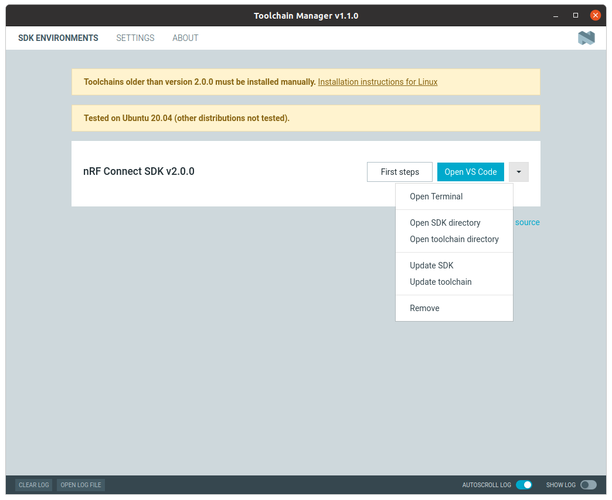

# Zephyr - Coaps Demo Client with Eclipse/TinyDtls

This [zephyr](https://www.zephyrproject.org/) client demonstrates to use coaps ([CoAP](https://tools.ietf.org/html/rfc7252) over [DTLS 1.2](https://tools.ietf.org/html/rfc6347)) with the [Eclipse/TinyDtls Library](https://github.com/eclipse/tinydtls). In combination with [Eclipse/Californium](https://github.com/eclipse/californium) as Cloud-Server, it enables a device to use [DTLS 1.2 Connection ID](https://tools.ietf.org/html/rfc9146), which obsolete the commonly used frequently DTLS handshakes and eliminates that expensive overhead.
Reducing the messages exchange mostly down to two ip-messages (one request, one response), it enables your device for

- reliable, 
- efficient, and 
- end-to-end encrypted

mobile communication (LTE-M, NB-IoT) for messages up to a few hundred bytes.
In combination, CoAP / DTLS CID and LTE-M/NB-IoT, enables to build mobile applications with 

- zero-install and 
- high cost-efficiency.

The demo client itself is in early development stage. In "good weather", the `Thingy:91` flies from battery for 4 weeks. In "storm" it may require the be switched off and on again. That should be rare exceptions. With version 0.2 the main cause of longer periods of lost connectivity to the mobile network is fixed.

The demo client is intended as groundwork for your own ideas. "Out-of-the-box" this application is only useful to easily check, if mobile IoT works at the locations and environment you want to use it. To build products and applications on this protocol stack requires to implement a production client and to adapt the coap-server for your function. The demo targets therefore people, which are already common with [zephyr](https://www.zephyrproject.org/), or, even better, common with the development for the [Thingy:91](https://www.nordicsemi.com/Products/Development-hardware/Nordic-Thingy-91) itself.
Without that knowledge it will be hard an time consuming to make benefit out of this demo.

**Note:**
The demo client is considered to use CoAP/DTLS CID. Without server-side support for DTLS CID, it will not work proper. Please ensure, that your server supports that.

## Supported Devices

| For now, only the<br/> [Nordic Semiconductor Thingy:91](https://www.nordicsemi.com/Products/Development-hardware/Nordic-Thingy-91)<br/> is supported. |  |
| :- | - |

The `Thingy:91` demo works with [ncs-2.0.1](https://github.com/nrfconnect/sdk-nrf/tree/v2.0.1).

To benefit from the newer modem features, please consider to use the modem firmware [1.3.2](https://www.nordicsemi.com/-/media/Software-and-other-downloads/Dev-Kits/nRF9160-DK/nRF9160-modem-FW/mfw_nrf9160_1.3.2.zip). See ["Getting started with Thingy:91"](#install-tools-and-tool-chains) below how to apply it.

Maybe other modems and devices gets supported over the time as well.

## Required HW-Tools for Thingy:91

In order to use this demo with your `Thingy:91`, you need:

- a `Thingy:91` (maybe better two ;-)).
- the `Thingy:91` is usually shipped with a SIM card. Check, if that covers your [area/country](https://www.nordicsemi.com/-/media/Software-and-other-downloads/3rd-party/iBasis-simplified-coverage-map-for-web.pdf). If not, you need a SIM card for your area/country. (Sometimes the `Thingy:91` is shipped with an expired SIM card. Then you will need also an other one.)
- a debug probe to flash the device.
   - either a [nRF9160-DK](https://www.nordicsemi.com/Products/Development-hardware/nRF9160-DK) and a [10-wire-ribbon connector, 2x5, 0.050"](https://www.digikey.com/en/products/detail/harwin-inc/M50-9100542/4953091).
   - or a [j-Link](https://www.segger.com/products/debug-probes/j-link/) and a [cortex-M adapter](https://www.segger.com/products/debug-probes/j-link/accessories/adapters/9-pin-cortex-m-adapter/).

## Run It - Fast Track

It's not recommended, but you may start with using a pre-build firmware binary. Usually that will take about 1h to send a first message with your `Thingy:91`.

[Fast Track](./docu/FASTTRACK.md)

## Build

In order to be able to build the demo-client, you need to install the development environment. That will take up to an afternoon to send your a message with your `Thingy:91`.

### Install Tools and Tool-Chains

Basically, this requires to follow [Developing with Zephyr](https://docs.zephyrproject.org/latest/develop/index.html).
Though for now only the [Nordic Semiconductor Thingy:91](https://www.nordicsemi.com/Products/Development-hardware/Nordic-Thingy-91) is supported, it may be easier to go through [Getting started with Thingy:91](https://developer.nordicsemi.com/nRF_Connect_SDK/doc/latest/nrf/ug_thingy91_gsg.html). This also required, if you want to update your modem firmware.

Please check the proper installation of your tools building some of the provided samples there (e.g. [zephyr/samples/basic/blinky](https://github.com/zephyrproject-rtos/zephyr/tree/main/samples/basic/blinky) or/and [nrf/samples/nrf9160/udp](https://github.com/nrfconnect/sdk-nrf/tree/main/samples/nrf9160/udp)).

**Note:** both, the zephyr's "developing" and Nordic Semiconductor's "getting started" has changed and may change over time and so it's hard to give good advice. Currently I have good experience with [Nordic Semiconductor - Installing manually](https://developer.nordicsemi.com/nRF_Connect_SDK/doc/latest/nrf/gs_installing.html) and Ubuntu 20.04. Installing [nRF Connect for Desktop](https://www.nordicsemi.com/Products/Development-tools/nrf-connect-for-desktop/download#infotabs) and apply the "Toolchain Manager" app works as well on Ubuntu 20.04  (support for 18.04 has been removed for the `nRF Connect for Desktop`). To use this toolchain-manager-installation after installing, start a terminal from that app to get a command console with an setup environment.



The toolchain-manager-installation also requires a slightly modified sources download, see ["Download the Sources into an available zephyr workspace"](#download-the-sources-into-an-available-zephyr-workspace)

### Download the Sources

This demo comes with a [west.yml](./west.yml) description. Download the demo:

```sh
west init --mr main -m https://github.com/boaks/zephyr-coaps-client.git zephyr-coaps-client
```

> **Note:** 
Please obey the `--mr main`.
Otherwise it will fail fetching the non existing "master" branch!

That creates a `zephyr-coaps-client` folder and you need to populate it further:

```sh
cd zephyr-coaps-client
west update 
```

That takes a while (couple of minutes). It downloads zephyr, the Nordic Semiconductor SDK and the tinydlts zephyr module.

Currently the demo uses the [zephyr-cid-develop](https://github.com/boaks/tinydtls/tree/zephyr_cid_develop) branch of my tinydtls fork. This is only intended for temporary convenience because currently many PRs are pending at the [eclipse repo](https://github.com/eclipse/tinydtls) and it will take some time to get them merged into "develop" or "main" there. When done, this demo will be switched to that [eclipse repo](https://github.com/eclipse/tinydtls).

### Download the Sources into an available zephyr workspace

Using 

```sh
west init --mr main -m https://github.com/boaks/zephyr-coaps-client.git zephyr-coaps-client
```

from a toolchain-manager-installation, fails with an error message, that a workspace already exists.
In order to add just this coaps-demo-app and the tinydtls module library to a workspace, open the workspace (for ncs the "ncs" installation folder and change to "v2.0.0" folder there). Here you find a ".west" folder, that contains the west-configuration for the workspace. Rename that ".west" folder into ".west.org" in order to replace that west-configuration by the one from this example. Now execute 

```sh
west init --mr main -m https://github.com/boaks/zephyr-coaps-client.git
```

That creates a new west-configuration. You need to populate it further:

```sh
west update 
```

That takes a couple of seconds, though zephyr and nrf is already downloaded.

### Build & Flash

After `west` completes the update, build the firmware:
Change the current directory to "zephyr-coaps-client/coaps-client" (or "<workspace>/coaps-client").

```sh
cd coaps-client
west build -b thingy91_nrf9160_ns
```

and then flash that resulting firmware to your device

```sh
west flash
```

See also [Updating Firmware Through External Debug Probe](https://developer.nordicsemi.com/nRF_Connect_SDK/doc/latest/nrf/ug_thingy91_gsg.html#updating-firmware-through-external-debug-probe).

## Run It

After flashing, the `Thingy:91` starts to blink slow (purple) and after attaching to the mobile-network it switches to green. If the LED is switched off, the device is also connected with the plugtest-server of the [Eclipse/Californium Sandbox](https://github.com/eclipse/californium#interop-server).

Press the `Thingy:91`'s call-button (the symbolic "N" in the center of the orange cover). The LED should start with blue and changes very fast to lightblue. If it is re-attached at the mobile-network, it switches to green. And if the response from the server is received, the LED switches off again. On error, the LED is switched to red. Usually it takes all together 1 second (LTE-M/CAT-M1) and only 2 ip-messages are exchanged.

(If you use the [nRF9160-DK](https://www.nordicsemi.com/Products/Development-hardware/nRF9160-DK), then press "Button 1".)

Done.

The demo client exchanges encrypted messages with the coap-server. These messages are only for demonstration, the data is considered to be replaced by your own ideas.

Demo message:

```
15641 s, Thingy:91 v0.2, 0*43, 1*0, 2*0, 3*0, failures 0
4160 mV 95% charging (V)
RSSI: 255,255
Network: CAT-M1
```

It starts with the up-time in seconds in the first line, followed by the label "Thingy:91" and a sent statistic. "`0*43`" := 43 exchanges without retransmission, "`1*0`" := no (0) exchanges with 1 retransmission. The current exchange is not included in this statistic. The second line contains the battery status and the third the receiving signal strength. The next line contains the network mode (CAT-M1 or NB-IoT).

The demo uses the "echo" resource of the plugtest-server, therefore the response contains just the same message.

If you want to see, what your `Thingy:91` has sent to the server, see [cf-browser](./docu/CFBROWSER.md).

## Configuration

The application comes with a [KConfig](blob/main/Kconfig) to configure some functions. Use

```
west build -b thingy91_nrf9160_ns -t menuconfig
```

for the console variant, and

```
west build -b thingy91_nrf9160_ns -t guiconfig
```

for the GUI variant.

For details please read the provided help for this settings and the [Configuration](./docu/CONFIGURATION.md) page.


## Next Steps

As mentioned at the introduction, the demo is intended as groundwork for your own ideas. 

[Next Steps](./docu/NEXTSTEPS.md)  

See also [Roadmap](./docu/ROADMAP.md) for the plan of the next months.

If you want ot consider the pwoer consumption in your idea, please see [Power Consumption](./docu/POWERCONSUMPTION.md)

### Updating to a Newer Versions

First update the project itself using 

```sh
cd coaps-client
git pull
```

then update the other modules using

```sh
cd ..
west update
```

In many cases, the next build requires to use 

```sh
cd coaps-client
west build -b thingy91_nrf9160_ns --pristine
```

The `--pristine` resets the current configuration. You may need to configure it again.
In some rare cases it may be even required to remove the "build" folder before.

## Licenses

This demo itself is licensed under [EPL-2.0](./licenses/EPL-2.0.txt).

Some files are used especially for the `Thingy:91` and are licensed under [Nordic-5](./licenses/Nordic-5.txt). This files are only licensed to be used with Nordic Semiconductor devices.
See [boards](./boards) and [child_image](./child_image).

The demo uses several third-party content, please refer to [NOTICE](./NOTICE.md) for details.
