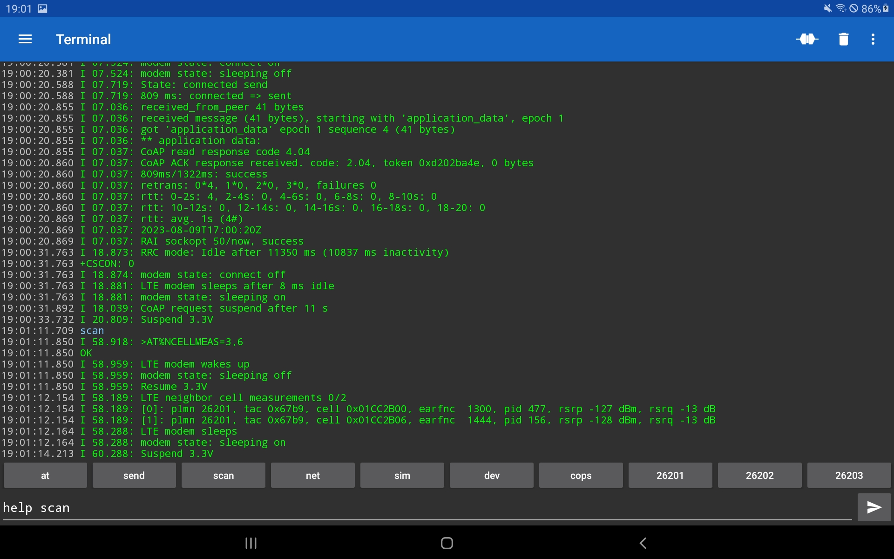

## Zephyr - Coaps Demo Client with TinyDtls

** !!! Under Construction !!! **

# Cellular Explorer

The 
| [Nordic Semiconductor, Thingy:91](https://www.nordicsemi.com/Products/Development-hardware/Nordic-Thingy-91) |  |
| :- | - |

comes with an Bluetooth Low Energy interface, that allows to connect the `Thingy:91` to a smartphone and send locally commands to the `Thingy:91` and receive the responses without cellular connectivity.

In order to enable this function, the [at-cmd-prj.conf](../at-cmd-prj.conf) must be used to build the app.

Other devices without Bluetooth Low Energy interface may also be used via a USB serial. The

| [Circuit Dojo, nRF9160 feather v5](https://www.jaredwolff.com/store/nrf9160-feather/) |  |
| :- | - |

comes with a USB-C plug and if the smartphone is also equipped with USB-C, a simple USB-C to USB-C wire will do it. Not that comfortable as  Bluetooth Low Energy, but it works.

## Enable Bluetooth Low Energy

If you connect the `Thingy:91` via USB to your PC, a "local USB drive" pops up.

.

Edit the "Config.txt" file.

```
==========================================
  Nordic Thingy:91 Configuration options
==========================================
The parameters below can be changed at runtime.

NOTE: For changes to take effect,
safely disconnect (unmount) the drive and disconnect the USB cable.
==========================================
BLE_ENABLED=1
BLE_NAME=Thingy:91-2 UART
```

Enable BLE by changing the `BLE_ENABLED=0` to `BLE_ENABLED=1`. Also consider to change the `BLE_NAME=Thingy:91 UART` to a rather unique name. Save your changes.

## Smartphone App

In order to communication with the `Thingy:91` via Bluetooth Low Energy you need a App which supports the `Nordic BLE UART` service.

For Android the "Serial Bluetooth Terminal 1.43" from [Kai Morich](http://www.kai-morich.de/android) works very well.

For iOS the "Bluefruit Connect" works.

If you want to use the USB serial, the "Serial USB Terminal 1.43" from [Kai Morich](http://www.kai-morich.de/android) works also very well.

Install the App and connect the `Thingy:91`.

## Usage

The most [nRF9160 AT-commands](https://infocenter.nordicsemi.com/pdf/nrf9160_at_commands_v2.3.pdf) are supported. Additionally some shortcuts and extra functions are available. Type `help` and press the "send button" :


If the App offers macros, add you favorite AT-commands or commands as macro.

## Explore the Cellular Network

Hopefully in the most areas the device should be able to connect to the network and to exchange data with the cloud. To test that, type `send` and press the "send button" :



If that doesn't work or, if you want to see, which cellular networks are available, then type `scan` and press the "send button" 

The displayed list will vary. As default, `scan` measure the currently already known channels. If you want to perform a network search, provide additional parameters. For such cases, a command comes also with a specific help. Type `help scan` and press the "send button" 


To perform a complete network search, use `scan 5 <n>` where `n` is the maximum expected number of network. It will take a while. The provided parameters will become the new default. if you decide to use `scan 5 6`, the next execution of `scan` will also use these parameters.


In some case you may get aware, that your modem connects to a network with less signal strenght than other available networks. With the `net` command you see, to which provider the device is connected and which technology is used, `LTE-M` or `NB-IoT`. If you want to test the communication with an other provider and/or switching the technology, use to `cfg` command. Also this command has a specific help.


To switch the provider and technology, use `cfg 26202 m1`.


that requires some time. If the network operator rejects your SIM, you need to change the `cfg` again.

** !!! Under Construction !!! **
