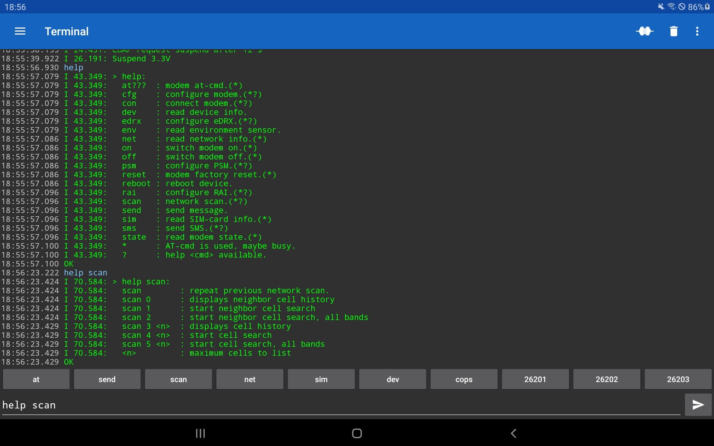
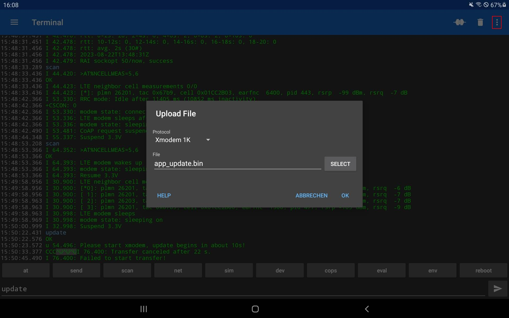

## Zephyr - Coaps Demo Client with TinyDtls

** !!! Under Construction !!! **

# Cellular Explorer 

| | |
| :- | - |
| The [Nordic Semiconductor, Thingy:91](https://www.nordicsemi.com/Products/Development-hardware/Nordic-Thingy-91) comes with an Bluetooth Low Energy interface, that allows to connect the `Thingy:91` to a smartphone and send locally commands to the `Thingy:91`. That helps to analyze network situations even without valid cellular connectivity of your SIM card. |  |
| The [Circuit Dojo, nRF9160 feather v5](https://www.jaredwolff.com/store/nrf9160-feather/) comes with a USB-C plug and if the smartphone is also equipped with USB-C, a simple USB-C to USB-C wire will do it. |  |

In the wild, the Bluetooth Low Energy interface is really very comfortable. If your device has only USB, that works also well, but is less comfortable.
For some more sophisticated tests, e.g. adapting some lists on the SIM card, it may be easier to use a PC via a USB serial as well.

In order to enable this function, the [at-cmd-prj.conf](../at-cmd-prj.conf) must be used to build the app.

## Enable Bluetooth Low Energy on a Thingy:91

If you connect the `Thingy:91` via USB to your PC, a "local USB drive" pops up.

.

Edit the "Config.txt" file.

```
==========================================
  Nordic Thingy:91 Configuration options
==========================================
The parameters below can be changed at runtime.

NOTE: For changes to take effect,
safely disconnect (unmount) the drive and disconnect the USB cable.
==========================================
BLE_ENABLED=1
BLE_NAME=Thingy:91-2 UART
```

Enable BLE by changing the `BLE_ENABLED=0` to `BLE_ENABLED=1`. Also consider to change the `BLE_NAME=Thingy:91 UART` to a rather unique name. Save your changes. When done, unmount the "local USB drive" and disconnect the USB cable.

## Smartphone App

In order to communication with the `Thingy:91` via Bluetooth Low Energy you need a App which supports the `Nordic BLE UART` service.

{#android}
For Android the "Serial Bluetooth Terminal 1.43" from [Kai Morich](http://www.kai-morich.de/android) works very well.

For iOS the "Bluefruit Connect" works.

If you want to use the USB serial, the "Serial USB Terminal 1.43" from [Kai Morich](http://www.kai-morich.de/android) works also very well for Android.

Install the App and connect the `Thingy:91`.

## PC Software
 
If you want to use a PC to communicate with the device via the USB serial interface, you will need a serial terminal to do so. For Microsoft Windows [Tera Term](https://ttssh2.osdn.jp/index.html.en) works well, for Linux [gtkterm](https://github.com/Jeija/gtkterm) is a good choice.

## Usage

The most [nRF9160 AT-commands](https://infocenter.nordicsemi.com/pdf/nrf9160_at_commands_v2.3.pdf) are supported. Additionally some shortcuts and extra functions are available as custom commands. For simple usage, these custom commands uses simple characters and digits, instead of control characters as '+', '%' or '='. Type `help` and press the "send button" :



(The screenshot shows only the list of commands in August 2023, the current list may contain more commands.)

If the smart phone App offers macros, add you favorite AT-commands or commands as macro.

## Explore the Cellular Network

Hopefully in the most areas the device should be able to connect to the network and to exchange data with the cloud. To test that, type `send` and press the "send button" :


If that doesn't work or if you want to see, which cellular networks are available at your location, then type `scan` and press the "send button" 

The displayed list of networks will vary. As default, `scan` measure the currently already known channels. If you want to search for new channels, provide additional parameters. For such cases, a command comes also with a specific help. Type `help scan` and press the "send button"  (see [screenshot above](#usage)). 

To perform a scan with searching for new channels, use `scan 5 <n>` where `n` is the maximum expected number of networks. It will take a while. The provided parameters will become the new default. if you decide to use `scan 5 6`, the next execution of `scan` will also use these parameters.


In some case you may get aware, that your modem connects to a network with less signal strenght than other available networks. With the `net` command you see, to which provider (the [PLMN](https://mcc-mnc.com/)) the device is connected and which technology is used, `LTE-M` or `NB-IoT`. If you want to test the communication with an other provider and/or switching the technology, use to `con` command. Also this command has a specific help.


To switch the network operator (e.g. `26202`) and technology (`m1` or `nb`), use `con 26202 m1`.


that requires some time. If the network operator rejects your SIM, you need to `con` to an other network operator again.

## Locating a Device

Sometimes it may be interesting to know the current location of the device. If the App doesn't use GPS, you still may be able to get a rough location using the base station as reference. There are several web-sites which offers a service for that. One service fro non-commercial usage is [cellmapper](https://www.cellmapper.net).

You will need the PLMN and the tower code (Cell devided by 256), e.g. PLMN `24008` and Cell `28609803` resulting in `111757`. Open the [cellmapper](https://www.cellmapper.net) and first set the PLMN using `Menu` -> `Provider`. 


Then close the `Provider Menu` and open the `Search Menu`. 

 

enter the calculated tower number and press `<return>`. I dialog will show up and, if the position of the tower is available, the entry of that tower will be shown.

 

Select the entry (`eNB <tower number>`) and a map will be opened showing the position of the base station.

## Test Functions and Parameter of a Cellular Network

If you have connected the device with the provider and technology you want to investigate, you may check with `net`, which functions are supported.

```
> net

I 60.855: Network: CAT-M1,roaming,Band 20,PLMN 26202,TAC 47490,Cell 52262913,EARFCN 6300
I 60.855: PDN: flolive.net,100.64.55.203
I 60.856: PSM: TAU 90000 [s], Act 0 [s], AS-RAI, Released: 2015 ms
I 60.856: !CE: down: 8, up: 1, RSRP: -108 dBm, CINR: -3 dB, SNR: -2 dB
I 60.865: Stat: tx 1 kB, rx 0 kB, max 748 B, avg 155 B
I 60.865: Cell updates 3, Network searchs 2 (8 s), PSM delays 0 (0 s), Restarts 0
I 60.865: Wakeups 1, 1 s, connected 11 s, asleep 0 s
OK
```

Each line may starts with a level ('E'rror, 'W'arning, 'I'nfo, or 'D'ebug), which is sometimes usefull for development. If the lines shows a 'b'usy, then the mode is currently executing a command and will reject further commands. After that level a relative time follows with seconds and milliseconds, e.g. "60.856".

That is followed by text, which explains itself a lot. E.g. CAT-M1, roaming, PLMN and so on. 

For energy saving three function are available for cellular devices:

| Mode | Description | |
| - | :- | :- |
| RAI | Release Assistance Indication | Indicates to switch from RRC active to idle earlier than using a timeout |
| eDRX | Extended Discontinuous Reception | Used in RRC idle mode to reduce power consumption. Usually seconds to a couple of minutes |
| PSM | Power Saving Mode | Enables the device to go from idle into deep sleep. Usually hours or a couple of days |

### rai Command

The device usually tries to request RAI support. If not available, then the timeout is used. Therefore rai is always enabled and if supported, the `net` command shows that in the PSM information.

```
I 60.856: PSM: TAU 90000 [s], Act 0 [s], AS-RAI, Released: 2015 ms
```

In this case, AS-RAI (Access Stratum RAI) is supported from LTE-M network provider.

To disble RAI for tests, you may use 

```
rai off
```

and with 

```
rai on
```

RAI is requested again.

### edrx Command

To request or disable eDRX, use the edrx command:

```
edrx 600
```

requests eDRX with about 600s. Only selected values are supported, the network will assign the next larger value, in this case 655s.

```
I 14.984: eDRX enable, 655.36 s
```

```
edrx off
```

disables eDRX again.

### psm Command

To request or disable PSM, the psm command is used.

```
I 78.096: > help psm:
I 78.096:   psm <act-time> <tau-time>[h] : request PSM times.
I 78.096:      <act-time>    : active time in s.
I 78.096:      <tau-time>    : tracking area update time in s.
I 78.096:      <tau-time>h   : tracking area update time in h.
I 78.096:   psm normal       : PSM handled by application.
```

```
psm 10 48h
```

requests psm with an active timeout of 10s and a tracking are update time of 48 hours or 2 days.

```
I 28.595: PSM enable, act: 10 s, tau: 50 h
...
I 29.265: PSM parameter update: TAU: 180000 s, Active time: 10 s
```

Also here, not all values are available and the next larger one is used. 

```
psm normal
```

Switches the back to the application specific PSM parameters.

### Firmware update Command

To update the application firmware, you classically have two options:

- using a [Segger j-link](https://www.segger.com/products/debug-probes/j-link/)
- using the [McuBoot via USB serial](https://developer.nordicsemi.com/nRF_Connect_SDK/doc/latest/nrf/device_guides/working_with_nrf/nrf91/thingy91_gsg.html#programming-firmware)

The downside of both options is, that you need to open the cover. For the `McuBoot via USB serial` you also need to start the device on the bootloader mode pressing and holding `SW3` during switching on the power with `SW1`.

To simplify that process, that `Cellular Explorer` comes with an `update` command.

In order to use it, you need:

- the application binary (the `app_update.bin` in the `<build>/zephyr` folder. The file is next to the `app_signed.hex`, which is used for the `Nordic nRF Connect for Desktop / Programmer`).
- a serial terminal with XMODEM or XMODEM 1k support.
- If a `Thingy:91` is used, please update the nRF52840 to version `thingy91_nrf52_connectivity_bridge_2023-03-02_8f26142b.hex` or newer. Some older version show some instability which may break the file transfer. Caused by that, the transfers stucks and breaks the transmission from the `Thingy:91` to your smartphone. You will even not see further messages from the `Thingy:91` and a power on restart gets required. The `thingy91_nrf52_connectivity_bridge` is part of the `Precompiled application and modem firmware` package and can be downloaded from [Nordic-Thingy-91/Download](https://www.nordicsemi.com/Products/Development-hardware/Nordic-Thingy-91/Download#infotabs).

For Android both [Serial Terminal 1.43](#android) from [Kai Morich](http://www.kai-morich.de/android) are supporting XMODEM and may be used to update the firmware. That even works over Bluetooth Low Energy.

For Microsoft Windows [Tera Term](https://ttssh2.osdn.jp/index.html.en) supports XMODEM, for Linux [gtkterm](https://github.com/Jeija/gtkterm) and the unix `sx` shell command will do it.

The update is started using the `update` command.


This starts to erase the second flash slot to prepare that for the new application firmware. This takes about 10s and gives the time to start the `XMODEM` file transfer on the smartphone or PC.

For [Serial Terminal 1.43](#android) select the menu on the upper left, next to the trash can (see red rectangle in the screenshoot below) and then the "Upload File" submenu. The file dialog appears.



Select `Xmodem 1k` as protocol and the `app_update.bin` as file. Press `OK` and the file upload will start, when the 10 seconds are over.


Sometimes the 10 seconds are too short to select the file. Then just open the file dialog via the menu and "Upload File" submenu. Select the file at rest and choose the `Xmodem 1k` as protocol. Press `OK` and then `CANCEL` in the "Upload File" field, which appears at the top below the tools-line. That will set this values as default and the next time the file dialog is shown you may just press `OK`.   

During the upload the [Serial Terminal 1.43](#android) shows some `^F` indicating the progress. Finally, when all succeeds, the device reboots to apply the update. The reboot will take a while copying the firmware from the download slot to the active slot and the old firmware to that download slot. After that the device continues to start the new application firmware. To prevent the device from being bricked, the device verifies the application firmware with the first successful data exchange. If the device reboots again before that, the old firmware is actived again. For that, don't apply a firmware update with low network coverage.

** !!! Under Construction !!! **
