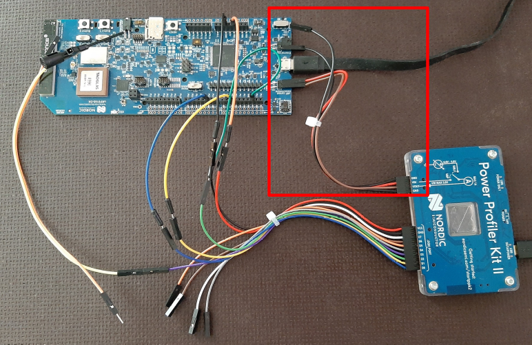

## Zephyr - Coaps Demo Client with TinyDtls

** !!! Under Construction !!! **

# Power Measurements

It is always a good idea to use those devices, including the antennas, for power measurements, which are intended for the "wild". However sometimes it is easier to start the measurements with a different device, because the wiring is easier. A [Nordic Semiconductor - nRF9160-DK](https://www.nordicsemi.com/Products/Development-hardware/nRF9160-DK) is in my experience a device, where it is very easy to wire it and start with the first experience in power measurements.

There are several tools out, which enables to measure the power consumption. A common amper meter will fail in many cases, because the time resolution is not good enough. Some others of those tools are quite expensive, but that may pay off for professional usage.

In my experience, the [Nordic Semiconductor - Power Profiler Kit II (PPK2)](https://www.nordicsemi.com/Products/Development-hardware/Power-Profiler-Kit-2) is a good compromise between price and function. It doesn't measure the power directly, but instead it measures the current with a high current resolution as well as high time resolution. 

## Power Profiler Kit II

In order to use the [Nordic Semiconductor - Power Profiler Kit II (PPK2)](https://www.nordicsemi.com/Products/Development-hardware/Power-Profiler-Kit-2), you need to install the [nRF Connect for Desktop](https://www.nordicsemi.com/Products/Development-tools/nRF-Connect-for-desktop) and the "Power Profiler" App. If you want to check the exchanged IP messages, also install the "Cellular Monitor". 

## Wiring

To measure the current, the tool is usually inserted into the VDD wire.
See [Power Profiler Kit II - Quick Start](https://docs.nordicsemi.com/bundle/ug_ppk2/page/UG/ppk/PPK_user_guide_Quick_start.html) how to do that.
The GND is also required to be connected. Some device will the record the energy (current multiplied by voltage) others only the current, as the `PPK2`. Though voltage usually doesn't change during the test, that also works as well.

| Device Power Rail | Tool Current | Function |
| :- | :- | :- |
| P21 / - / External supply (close to USB) | GND | Ground of power rail |
| P22, VDD nRF' (close to USB) | VIN | Current input |
| P22, VDD nRF (close to Debug out| VOUT | Current ouput |

(On P22 a jumper is mounted. To wire a current measurment tool, unmount that jumper and insert the wires.)

In some case it is also interesting, to correlate the phases of the device to their power consumes. To make that visible, GPIO outputs of the device may be connected to inputs of the tool. Using [Nordic Semiconductor - nRF9160-DK](https://www.nordicsemi.com/Products/Development-hardware/nRF9160-DK) together with the [Power Profiler Kit II - Logic Port](https://docs.nordicsemi.com/bundle/ug_ppk2/page/UG/ppk/PPK_user_guide_Connectors.html) does so. 

The application here in this project uses:

| Device GPIO (output) | Tool's Logic Port (input) | Function |
| :- | :- | :- |
| GND | GND | Ground of GPIO signals |
| VDD | VCC | VDD of GPIO signals |
| P0.05 | D0 | application exchange |
| P0.10 | D1 | network registered |
| P0.20 | D2 | RRC active |
| P30  | D3 | SIM card active |

(Let the jumper on P30 mounted. It's required to use the SIM card. Just try to add an additional wire in order to see the SIM card activity phases as well.)



The wires in the red rectangle are used for the current measurement. The other wires are used to signal the phases.

## Protocol Flavors Application

One of the most common questions around power consumption is the relation according the used protocols. Especially, if encryption is required, the differences in the overhead will be large and will influence the selection of the protocol or strategy of exchanging messages.

Using the [add-tcp branch](https://github.com/boaks/zephyr-coaps-client/tree/add_tcp) of this application enables you to make your own experience. The additional protocol flavors are just intended to be used to measure the power. Especially the TCP flavors of CoAP don't fully comply with [RFC 8323](https://www.rfc-editor.org/rfc/rfc8323.html). These additional protocols are not well tested for longer usage.

To build the `protocol flavors application` add the [protocols-prj.conf](../protocols-prj.conf) overlay to your build.

```
west build -d build_nrf9160dk_nrf9160_ns -b nrf9160dk_nrf9160_ns --pristine -- -DOVERLAY_CONFIG="protocols-prj.conf" -DCONFIG_NRF_MODEM_LIB_TRACE=y
```

The `-DCONFIG_NRF_MODEM_LIB_TRACE=y` enables the modem trace, which is required for the "Cellular Monitor", if you're also interested in the exchanged IP messages. 

The protocol flavor is selected for this application on startup. The [Nordic Semiconductor - nRF9160-DK](https://www.nordicsemi.com/Products/Development-hardware/nRF9160-DK) is equiped with two switches, 1 and 2. Select the intended protocol to tests and reset the device, maybe by starting the Cellular Monitor, or using the reset button next to the SIM card.

| nRF9160-DK Switch 1 | nRF9160-DK Switch 2 | Protocol Flavor |
| :- | :- | :- |
| n.c. | n.c. | CoAP/DTLS 1.2 CID/UDP |
| GND | n.c. | CoAP/UDP |
| n.c. | GND | CoAP/TLS 1.2/TCP |
| GND | GND | CoAP/TCP |

(**Note:** the TLS/TCP flavors of CoAP are experimental only, these are without signaling messages.)

Once the application has started, you exchange messages by pressing button 1.

## Alternative Tools to Measure Power

| Products | Price |
| - | - |
|[joulescope](https://www.joulescope.com/) | [\$999](https://www.joulescope.com/cart) |
|[qoitech](https://www.qoitech.com/) | [\$899 - \$1599](https://www.qoitech.com/buy/) |


** !!! Under Construction !!! **
