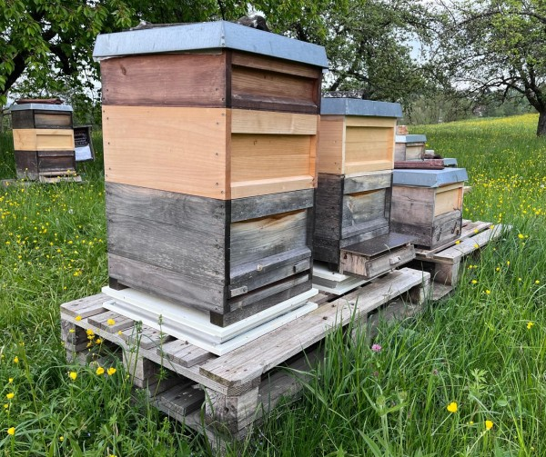
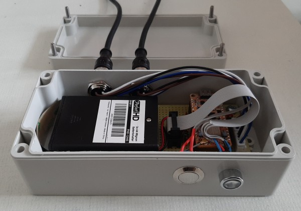

## Zephyr - Coaps Demo Client with TinyDtls

** !!! Under Construction !!! **

# Mobile Beehive Scale 

|  |  |
| :- | - |


This demo shows, how to build a [mobile-beehive-scale (currently only in German)](https://github.com/boaks/mobilebeehivescale) using the [Circuit Dojo, nRF9160 feather v5](https://www.jaredwolff.com/store/nrf9160-feather/).

The device tree of the mobile-beehive-scale is configure in the [hivescale-feather.overlay](../hivescale-feather.overlay).

To build the mobile-beehive-scale use:

```
# NCS 2.9.0
west build -d build_feather_nrf9160_ns -b circuitdojo_feather/nrf9160/ns --pristine -- \
   -DOVERLAY_CONFIG="60min0-prj.conf;at-cmd-prj.conf;hivescale-prj.conf" \
   -DDTC_OVERLAY_FILE="hivescale-feather.overlay" -DCONFIG_BATTERY_TYPE_ENELOOP_2000_MAH=y

# NCS 2.6.2
west build -d build_feather_nrf9160_ns -b circuitdojo_feather_nrf9160_ns --pristine -- \
   -DOVERLAY_CONFIG="60min0-prj.conf;at-cmd-prj.conf;hivescale-prj.conf" \
   -DDTC_OVERLAY_FILE="hivescale-feather.overlay" -DCONFIG_BATTERY_TYPE_ENELOOP_2000_MAH=y
```

That enables that device tree and also the usage of the 2000mA NiMh batteries.

The device tree.

```
nRF9160 feather
  |
  +-- GPIO / Call Button
  |
  +-- GPIO / RGB LED
  |
  +-- I2C-1
  |     |
  |     +-- ADC NAU7802
  |     |
  |     +-- EEPROM AT24HC04B
  |        
  +-- I2C-2
        |
        +-- ADC NAU7802
        |
        +-- EEPROM AT24HC04B

```

** !!! Under Construction !!! **
