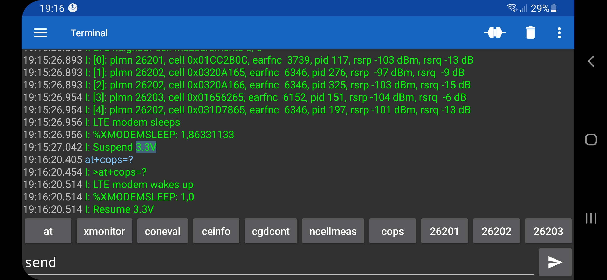

## Zephyr - Coaps Demo Client with TinyDtls

** !!! Under Construction !!! **

# Network Scanner

The 
| [Nordic Semiconductor, Thingy:91](https://www.nordicsemi.com/Products/Development-hardware/Nordic-Thingy-91) |  |
| :- | - |

comes with an Bluetooth Low Energy interface, that allows to connect the `Thingy:91` to a smartphone and send locally commands to the `Thingy:91` and receive the responses without cellular connectivity.

In order to enable this function, the [at-cmd-prj.conf](../at-cmd-prj.conf) must be used to build the app.

## Enable Bluetooth Low Energy

If you connect the `Thingy:91` via USB to your PC, a "local USB drive" pops up.

.

Edit the "Config.txt" file.

```
==========================================
  Nordic Thingy:91 Configuration options
==========================================
The parameters below can be changed at runtime.

NOTE: For changes to take effect,
safely disconnect (unmount) the drive and disconnect the USB cable.
==========================================
BLE_ENABLED=1
BLE_NAME=Thingy:91-2 UART
```

Enable BLE by changing the `BLE_ENABLED=0` to `BLE_ENABLED=1`. Also consider to change the `BLE_NAME=Thingy:91 UART` to a rather unique name. Save you changes.

## Smartphone App

In order to communication with the `Thingy:91` via Bluetooth Low Energy you need a App which supports the `Nordic UART` service.

For Android the "Serial Bluetooth Terminal 1.43" from [Kai Morich](http://www.kai-morich.de//android) works very well.

For iOS the "Bluefruit Connect" works.

Install the App and connect the `Thingy:91`. If the App offers macros, add you favorite AT-commands or commands as macro.

.

The most [nRF9160 AT-commands](https://infocenter.nordicsemi.com/pdf/nrf9160_at_commands_v2.3.pdf) are supported and additionally:


| Command | Description |
| :- | - |
| `help` | display list of commands |
| `reset` | modem factory reset |
| `reboot` | reboot device |
| `on` | switch modem on |
| `off` | switch modem off |
| `scan` | network scan |
| `send` | send message |
| `sim` | read SIM-card info |
| `at???` | modem at-cmd |

** !!! Under Construction !!! **
