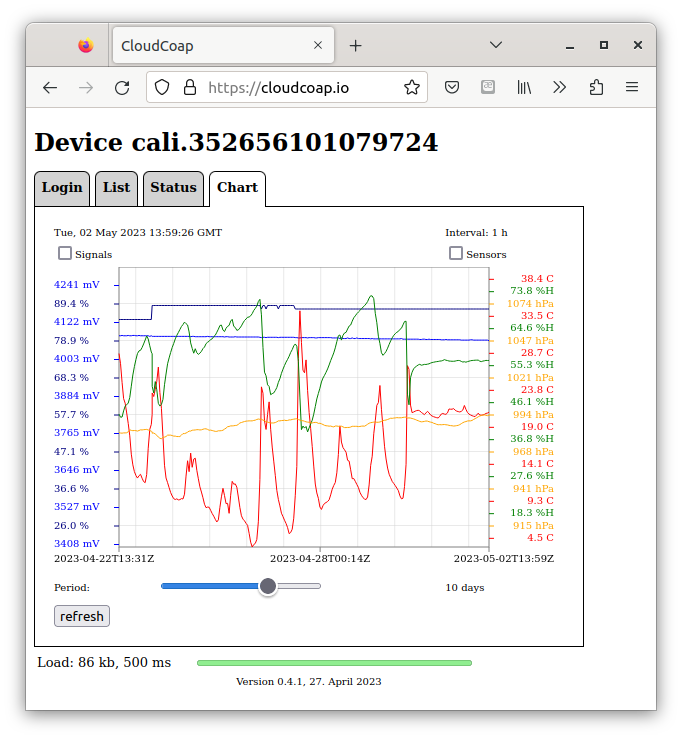

## Zephyr - Coaps Demo Client with TinyDtls

** !!! Under Construction !!! **

# Next Steps

The demo exchanges only a simple message with the coap-server. But that is the groundwork for many distributed systems. Not only IoT.

# CoAP / REST 

CoAP follows the [REST](https://de.wikipedia.org/wiki/Representational_State_Transfer) paradigm, also very wellknown by the users of the other representative, HTTP.

That comes with:

- [URI / Uniform Resource Identifier](https://de.wikipedia.org/wiki/Uniform_Resource_Identifier)
- [standardized methods](https://datatracker.ietf.org/doc/html/rfc7252#section-5.8) 
- application specific payload 

and enables to build powerful applications.

Both, the [zephyr coap client](https://github.com/zephyrproject-rtos/zephyr/tree/main/subsys/net/lib/coap) and the [Eclipse/Californium server](https://github.com/eclipse/californium/tree/main/californium-core#californium-cf---coap-core) supports you to use REST for your application.

# Adapting the Client

This is usually the easier part. It requires that you are common enough with [zephyr](https://www.zephyrproject.org/) and the required tools. The [zephyr coap client](https://github.com/zephyrproject-rtos/zephyr/tree/main/subsys/net/lib/coap) and [net/coap.h](https://github.com/zephyrproject-rtos/zephyr/blob/main/include/zephyr/net/coap.h) contains the required documentation.

# Adapting the Server

In many cases, it's also required to adapt the server. While this adaption itself isn't that hard, the pain comes with running an own server.

Californium's sandbox runs the [cf-plugtest-server](https://github.com/eclipse/californium/tree/main/demo-apps/cf-plugtest-server).

For your own setup a [cf-cloud-demo-server](https://github.com/eclipse-californium/californium/tree/main/demo-apps/cf-cloud-demo-server) is in preparation. It comes with configured `DTLS graceful restart` and a simple integrated HTTPs server to read the last posted data of your devices. A install script is available to speed up your first experience (see [cf-cloud-demo-server - installation](https://github.com/eclipse-californium/californium/tree/main/demo-apps/cf-cloud-demo-server#systemd-service)). This cloud-demo-server enables to add your own resources, see

[server - add a resource](https://github.com/eclipse/californium/tree/main/californium-core#server---add-a-resource)

For some applications the CoAP-S3-Proxy [cf-s3-proxy-server](https://github.com/eclipse-californium/californium/tree/main/demo-apps/cf-s3-proxy-server) simplifies the usage. That is in preparation as well. It comes with configured `DTLS graceful restart` and forwards the data send by the device to a S3 storage. It reads the user and device credentials from S3 or the file-system. Small and medium deployments benefits a lot from that. Finally, a Web-Browser javascript app displays that device data directly from S3 as text or chart. The reduces the need of an Web-Server to a HTTPs login servive, which is provided by the CoAP-S3-Proxy.

# Running the Server

To run the server, it requires a machine to do so. Depending on the amount of expected devices and messages, Californium may run even on an [Raspberry Pi](https://www.raspberrypi.com/products/) (starting with 1 GB RAM), and also on small cloud vm's (1 or 2 v-cores, 2 GB RAM, usually offered from 10-30 Euro per month). That enables to run even small systems on a dedicated coap-server. The coap-server must have a stable ip-address and must be reachable from the public internet or you need an ip-tunnel to your mobile provider.

## Installing the Server

Californium comes with some examples installation instructions for either 

- [old style unix systemd service](https://github.com/eclipse/californium/wiki/Californium-as-old-style-unix-systemd-service) or
- [Californium as k8s service](https://github.com/eclipse/californium/wiki/Californium-as-k8s-service).

To start with, usually the systemd-service may be easier. Using a cloud vm, [cloud-init](https://github.com/eclipse/californium/wiki/Californium-as-old-style-unix-systemd-service#cloud-init---automatic-cloud-vm-installation) may speed up your installation a lot. Just install the unmodified plugtest-server and then [update](https://github.com/eclipse/californium/wiki/Californium-as-old-style-unix-systemd-service#apply-jar-updates) it to your modified version.

The [cf-cloud-demo-server - installation](https://github.com/eclipse-californium/californium/tree/main/demo-apps/cf-cloud-demo-server#systemd-service) installs the server also as systemd-service. A similiar installation will follow for the [cf-s3-proxy-server](https://github.com/eclipse-californium/californium/tree/main/demo-apps/cf-s3-proxy-server).

** !!! Under Construction !!! **
