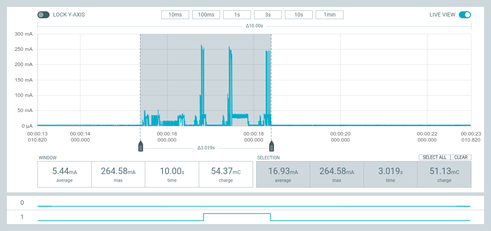
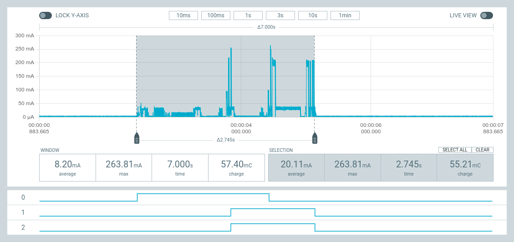
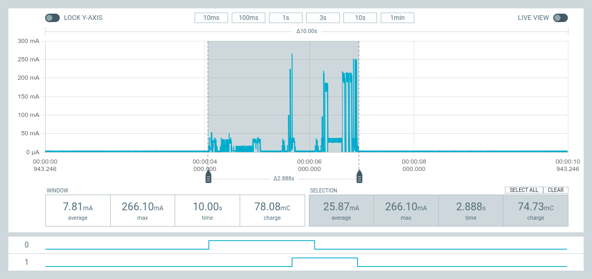
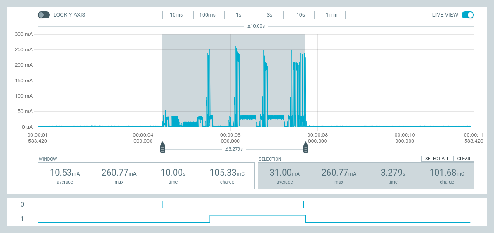
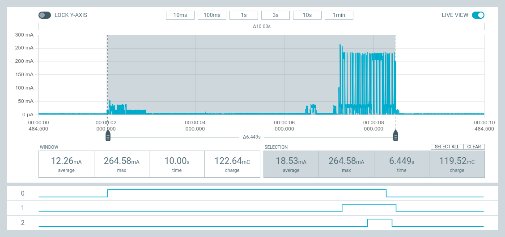
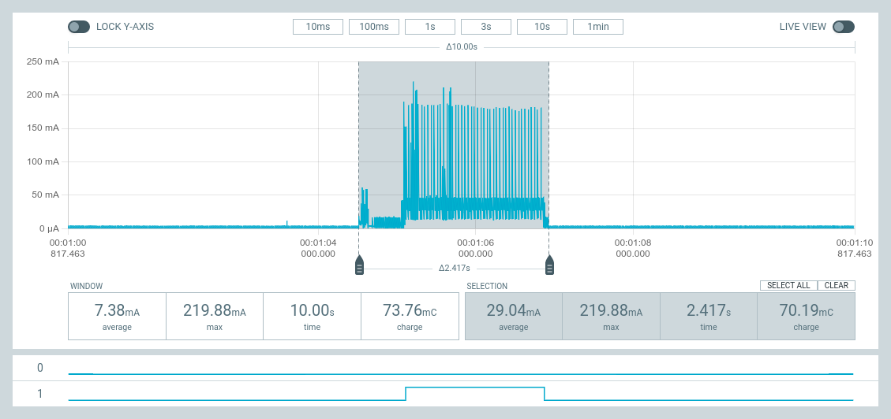
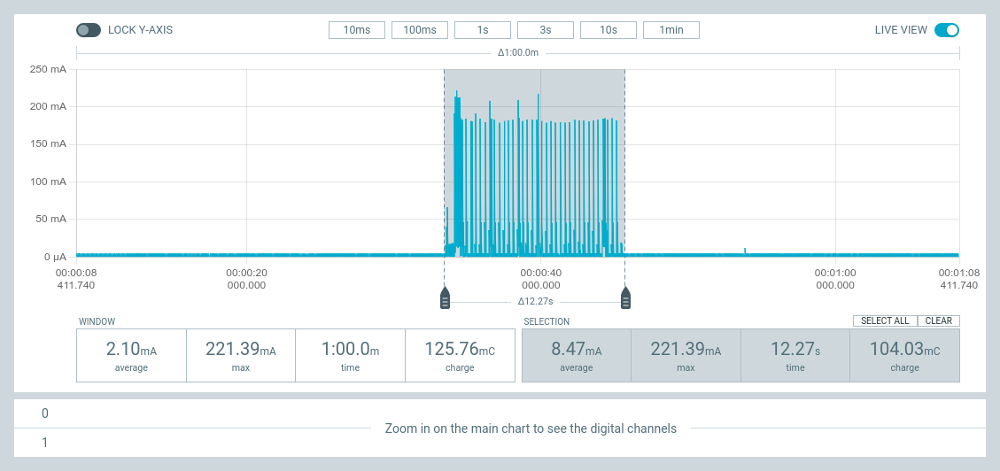
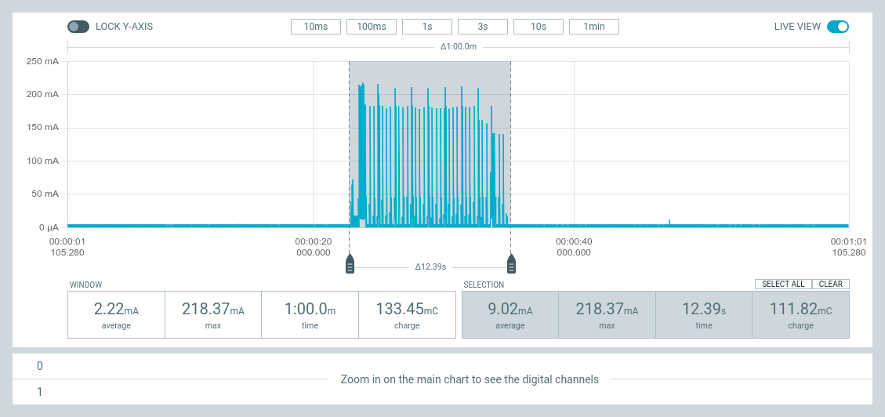
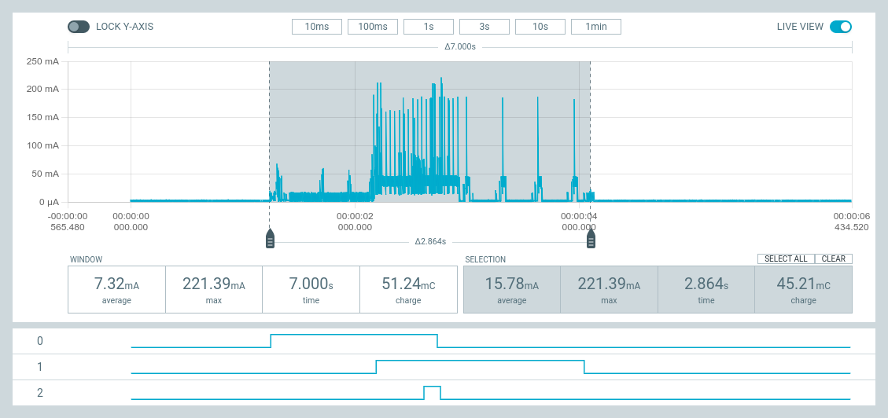
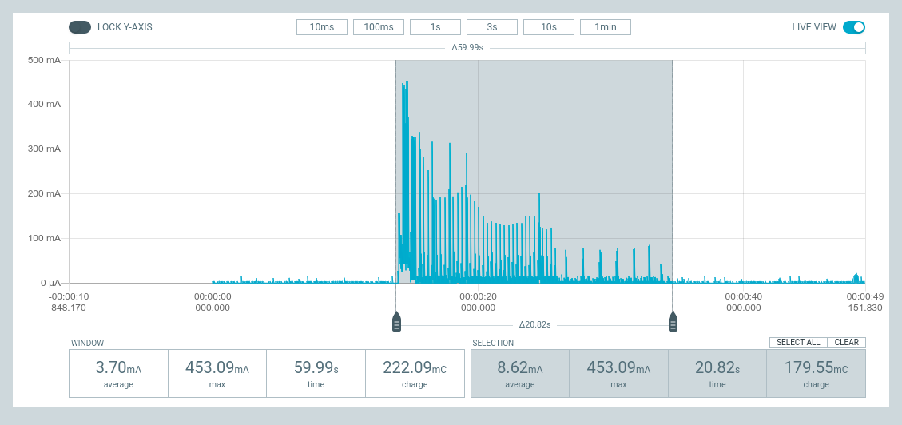

## Zephyr - Coaps Demo Client with TinyDtls

** !!! Under Construction !!! **

# Power Consumption

The measurements presented here are done using the [Nordic Semiconductor - Power Profiler Kit II (PPK2)](https://www.nordicsemi.com/Products/Development-hardware/Power-Profiler-Kit-2). The first part of these measurements are done using the [nRF9160-DK](https://www.nordicsemi.com/Products/Development-hardware/nRF9160-DK), the second with the [Thingy:91](https://www.nordicsemi.com/Products/Development-hardware/Nordic-Thingy-91).

The values for the `Thingy:91` are measurements replacing the battery with the PPK2 as source using about 4.1V.

The previous tests in June 2022 have been done with enabled UART and 3.3V. With that the device has a quiescent current of 0.8 mA and, assuming a 80% efficiency and a battery of 1350 mAh, it runs for 56 days from battery (see [Powerconsumption-2022-06](POWERCONSUMPTION-2022-06.md)).

Disabling the UART and the 3.3V results in quiescent current of 40 µA. With the same assumption of a 80% efficiency and a battery of 1350 mAh, that results in 27000h (or about 1125 days) runtime without sending any data. 20x times more than without disabling the UART and the 3.3V.

The self-discarge is unknown, but may reduce that time significantly. For the LiPo at least a second 40 µA self-discarging must be considered, which halfs that runtime to 550 days.

If you consider to use a [nRF9160 feather v5](https://www.jaredwolff.com/store/nrf9160-feather/), the quiescent current is about 14 µA for VIN in range from 3.3 to 4.1V. For voltages higher 4.1V, the quiescent current is also higher, up to 100µA. For usual operation on battery, that doesn't matter too much, but the benefit from the 14µA in the main range is really great. Using a `nRF9160 feather v5` with 3x AA [Eneloop 2000mAh](https://www.panasonic-eneloop.eu/en) batteries with extremely low self-discarging, there is a chance to run the feather for 2 years from battery, exchanging every hour a message with the cloud.

## General Considerations for LTE-M/NB-IoT

Using LTE-M or NB-IoT for a power constraint device mostly comes with the requirement to enable power saving functions. This tests uses PSM (Power Saving Mode) and RAI (Release Assistance Indication), if available. 
eDRX is not considered for now. The benefit of eDRX to be faster and more efficient on the wakeup is currently eaten up by an additional quiescent current of 25µA of the SIM cards.  

PSM is defined by three parameters:

- T???? (RRC Activity Timer, stopped by RAI, if available)
- T3324 (PSM Activity Timer)
- T3412 (TAU Timer)

The first one, the RRC Activity Timer, is given by the mobile network operator, see e.g [NB-IoT Feature matrix and associated parameters](https://docs.iotcreators.com/docs/nb-iot-network-information#nb-iot-feature-matrix-and-associated-parameters) or
[LTE-M Feature matrix and associated parameters](https://docs.iotcreators.com/docs/lte-m-network-information#lte-m-feature-matrix-and-associated-parameters).

The other two, PSM Activity Timer and TAU Timer, are negotiated by a request of the device and a response from the mobile network operator, which may deviate from the requested values. For the value range, consider the above references. 

If T3412 (TAU Timer) expires without message exchange, the device wakeups up, moves to RRC connected mode, send a TAU (Tracking Area Update) message, moves back to idle mode, and goes to sleep.

To exchange an application message, the devices wakes up, moves to RRC connected mode, exchanges the messages. It stays then in RRC connected mode until the RRC Activity Time expires or RAI indicates, that no more data is expected. Then the device moves back to the RRC idle mode. The device stays in idle mode for T3324 (PSM Activity Timer) until it goes back to power sleeping mode.

As of summer 2022, in my setup in south Germany, LTE-M comes with PSM but no RAI, NB-IoT comes with both PSM and RAI.

The tests are using a T3324 (PSM Activity Timer) of 0s.
The messages used are about 400 bytes to the server and 40 bytes back. In one test also a smaller message with 200 bytes is used.  

With that, the usage to send data is split into three phases:
- moving to connected mode
- exchanging messages
- moving to idle mode

There are also other phases, which are not considered here:
- initial network registration (easily up to 3 minutes)
- HPPLMN searches when switching to idle (easily up to 1 minute)
- wakeup with cell change
- wakeup changing from LTE-M to NB-IoT and visa versa

All these are taking more or less randomly amount of time and may occur also unintended. So they hard to take into consideration. I guess, they unfortunately half the runtime in too many cases.

In my experience especially HPPLMN searches may turn out to use quite a lot of energy. The interval of these HPPLMN searches is stored on the SIM card. Especially using global SIMs (IMSI starting with a 9) causes since nRF9160 mfw 1.3.2 an increased number of HPPLMN searches, though the current country code is not longer considered for such global SIMs. Using a global SIM with an interval of 2h causes a device, which exchanges every hour a message to increase the power consumption by 10 times.

The measurements differs from test to test. The charts shows just one example test run.

More details about PSM and other power saving functions can be found in:

[GSMA - Improving Energy Efficiency for Mobile IoT, March 2022](https://www.gsma.com/iot/wp-content/uploads/2022/02/2022.03-GSMA-Energy-Efficiency-for-Mobile-IoT-1.pdf).

[GSMA - NB-IoT Roaming Features April 2022](https://www.gsma.com/iot/wp-content/uploads/2022/04/NB-IoT-Roaming-Features-April-2022-Landscape.pdf)

[GSMA - NB-IoT Roaming Features September 2022](https://www.gsma.com/iot/wp-content/uploads/2023/03/GSMA-Mobile-IoT-Roaming-Features_Final_08.09.2022-NB-IoT.xlsx)

[GSMA - LTE-M Roaming Features September 2022](https://www.gsma.com/iot/wp-content/uploads/2022/11/GSMA-Mobile-IoT-Roaming-Features_Final_09.06.2022LTM-.xlsx)

[GSMA - Mobile IoT Deployment Map](https://www.gsma.com/iot/deployment-map/)

[Nordic Semiconductor - LTE-M vs NB-IoT Field Test: How Distance Affects Power Consumption](https://devzone.nordicsemi.com/nordic/nordic-blog/b/blog/posts/ltem-vs-nbiot-field-test-how-distance-affects-power-consumption)

## Summary:

In my experiments, the first question is, which quiescent current does your device have itself. The second one will be, which self-discarging of the battery must be considered. Only if that sum is low enough, the consumption of the message exchanges builds the calculation base for the runtime.

["All theory is gray"](https://quotethedayaway.wordpress.com/2013/06/05/all-theory-is-gray-my-friend-but-forever-green-is-the-tree-of-life/)

So I'm looking forward to complete my tooling, do the measurements for the Thingy:91 itself and then have a live-longterm-test run.

### Results of first longterm-tests - June 2022

See [Powerconsumption-2022-06](POWERCONSUMPTION-2022-06.md#results-of-first-longterm-tests-june-2022).

### Results of longterm-tests using low quiescent current - October 2022 to February 2023

Thingy:91, LTE-M, PSM, 1h message interchange interval

```
24-23:54:03 [d-hh:mm:ss], Thingy:91 v0.5.99, 0*576, 1*24, 2*1, 3*0, failures 0
4072 mV 84% battery (low-power)
Stat: tx 299kB, rx 41kB, max 526B, avg 287B, searchs 27, PSM delays 0

48-15:54:03 [d-hh:mm:ss], Thingy:91 v0.5.99, 0*1121, 1*46, 2*1, 3*0, failures 1
4034 mV 79% battery (low-power)
Stat: tx 585kB, rx 79kB, max 535B, avg 289B, searchs 52, PSM delays 0

66-00:54:04 [d-hh:mm:ss], Thingy:91 v0.5.99, 0*1521, 1*63, 2*1, 3*0, failures 1
4006 mV 75% battery (low-power)
Stat: tx 793kB, rx 107kB, max 535B, avg 289B, searchs 70, PSM delays 0

90-15:54:04 [d-hh:mm:ss], Thingy:91 v0.5.99, 0*2088, 1*87, 2*1, 3*0, failures 1
3972 mV 71% battery (low-power)
Stat: tx 1089kB, rx 147kB, max 535B, avg 289B, searchs 95, PSM delays 0

104-19:54:04 [d-hh:mm:ss], Thingy:91 v0.5.99, 0*2414, 1*100, 2*2, 3*0, failures 1
3954 mV 68% battery (low-power)
Stat: tx 1261kB, rx 170kB, max 536B, avg 290B, searchs 111, PSM delays 0
```

Forecast: 250 days

The device reseted itself after about 120 days (bug). With that I stopped this test.

Thingy:91, LTE-M, PSM, 24h message interchange interval

```
24-00:59:14 [d-hh:mm:ss], Thingy:91 v0.5.99, 0*2, 1*23, 2*0, 3*0, failures 0
4124 mV 90% battery (low-power)
Stat: tx 12kB, rx 2kB, max 525B, avg 258B, searchs 24, PSM delays 0

48-01:07:52 [d-hh:mm:ss], Thingy:91 v0.5.99, 0*2, 1*47, 2*0, 3*0, failures 0
4093 mV 87% battery (low-power)
Stat: tx 24kB, rx 3kB, max 525B, avg 271B, searchs 48, PSM delays 0

65-01:13:53 [d-hh:mm:ss], Thingy:91 v0.5.99, 0*2, 1*64, 2*0, 3*0, failures 0
4073 mV 84% battery (low-power)
Stat: tx 33kB, rx 5kB, max 525B, avg 275B, searchs 65, PSM delays 0

90-01:22:57 [d-hh:mm:ss], Thingy:91 v0.5.99, 0*2, 1*89, 2*0, 3*0, failures 0
4043 mV 81% battery (low-power)
Stat: tx 45kB, rx 6kB, max 525B, avg 279B, searchs 90, PSM delays 0
```

Forecast: 390 days

I stopped that test an will execute a new test with a nRF9160-feather and other batteries.

## Measurement Charts

### nRF9160-DK, NB-IoT with PSM and RAI

**NB-IoT Wakeup:**



This chart shows the frequently wakeup from PSM. The interval depends on
the negotiated T3412 (TAU Timer). Without sending data, it mainly moves to connected mode and back to idle.

It takes about 3s, with an average current of 17mA at 5V. That results in 0.07 mWh per wakeup. A wakeup every hour reduces the runtime of a Thingy:91 then to 830 days.

**NB-IoT One-Way-Message:**



This chart shows the wakeup from PSM with RAI to send one small message (200 bytes) without response. 

It takes about 2.7s, with an average current of 26mA at 5V. That results in 0.075 mWh per message. Sending every hour a message reduces the runtime of a Thingy:91 then to 818 days. Very close to the value or a wakeup without sending a message.



This chart shows the wakeup from PSM with RAI to send one normal message (400 bytes) without response. 

It takes about 2.9s, with an average current of 26mA at 5V. That results in 0.1 mWh per message. Sending every hour a message reduces the runtime of a Thingy:91 then to 730 days.

**NB-IoT Request-Response:**



This chart shows the wakeup from PSM with RAI to send one message and wait for the response. 

It takes about 3.3s, with an average current of 31mA at 5V. That results in 0.14 mWh per message exchange. Exchanging every hour a message reduces the runtime of a Thingy:91 then to 657 days.

### nRF9160-DK, NB-IoT with on/off

**NB-IoT Request-Response:**



This chart shows the power consumption, if the modem is switched on, a message is exchanged, and then the modem is switched off again.

It takes about 6.4s, with an average current of 18.5mA at 5V. That results in 0.165 mWh per message exchange. Exchanging every hour a message reduces the runtime of a Thingy:91 then to 617 days.

### nRF9160-DK, LTE-M PSM without RAI (not available in sommer 2022 in south Germany)

**LTE-M Wakeup:**



This chart shows the frequently wakeup from PSM. The interval depends on
the negotiated T3412 (TAU Timer). Without sending data, it mainly moves to connected mode and back to idle.

It takes about 2.4s, with an average current of 29mA at 5V. That results in 0.1 mWh per wakeup. A wakeup every hour reduces the runtime of a Thingy:91 then to 758 days.

**LTE-M One-Way-Message:**



This chart shows the wakeup from PSM without RAI to send one message without response. 

It takes about 12s, with an average current of 8.5mA at 5V. That results in 0.15 mWh per message. Sending every hour a message reduces the runtime of a Thingy:91 then to 658 days. The large time of 12s depends on the "RRC Activity Timer" (10s at my mobile network provider), which is provided by the network. Using RAI will reduce this time, but RAI is not supported in my region (south Germany).

**LTE-M Request-Response:**



This chart shows the wakeup from PSM without RAI to send one message and wait for the response. 

It takes about 12s, with an average current of 9mA at 5V. That results in 0.14 mWh per message exchange. Exchanging every hour a message reduces the runtime of a Thingy:91 then to 642 days.  The large time of 12s depends on the "RRC Activity Timer" (10s at my mobile network provider), which is provided by the network. Using RAI will reduce this time, but RAI is not supported in my region (south Germany) .

### nRF9160-DK, LTE-M on/off

**LTE-M Request-Response:**



This chart shows the power consumption, if the modem is switched on, a message is exchanged, and then the modem is switched off again.

It takes about 2.9s, with an average current of 15.7mA at 5V. That results in 0.06 mWh per message exchange. Exchanging every hour a message reduces the runtime of a Thingy:91 then to 850 days. The "RRC Activity Timer" is not used and the modem switches off very fast.

Note: switching on/off frequently may not be supported by your mobile netwotk operator.

### Thingy:91, LTE-M

**LTE-M Exchanging messages:**



This chart shows the complete power consumption of an message exchange (about 200 bytes request, 200 bytes response) including a wakeup from PSM. Additional to the wakeup itself, it depends on the message exchange (0,8s) and the time being "connected" (10s, without RAI, which is not availabel in my setup). The "active time", is set also to 8s for this test.

It takes about 22s, with an average current of 8.6mA at 4.1V. That results in 0.35 mWh. A message exchange every hour reduces the runtime of a Thingy:91 about 766 days, resulting in a theoretical runtime of 358 days.

We will see, how large the  self-discarge is and how many bugs will prevent proofing that timespan ;-).

## Disclaimer

Other studies have other results. There are studies, which demonstrates the effect of the amount of data, there are studies, which use always a DTLS handshake for each couple of bytes. Using DTLS 1.2 CID doesn't require that handshake and my measurements shows a larger influence of the moving to RRC connected mode than the amount of bytes.

Anyway, feel asked to test the power consumption on your own. And, please, report your results.

### Other studies:

[LPWAN Network and Protocols - Selection and Optimization](https://www.thalesgroup.com/en/markets/digital-identity-and-security/iot/resources/developers/cellular-iot-network-and-protocols)

As DTLS 1.2 CID demonstrates, handshakes are not required for every exchange.
About 1800 bytes for a PSK handshake seems to be large, maybe someone forgot to reduce the number of cipher suites on the client. These cipher-suites are included in the first message a client sends, the so called `ClientHello`. The pitfal here is, that this message is repeated including a cookie. Saving 100 bytes in the message results so in saving 200 in the handshake. So it's easy to lower that to 1400 bytes only using selected cipher suites. And again, using DTLS 1.2 CID reduces the amount of handshakes significantly.  

[Power Consumption Analysis of NB-IoT and eMTC
in Challenging Smart City Environments](https://cni.etit.tu-dortmund.de/storages/cni-etit/r/Research/Publications/2018/Joerke_GLOBECOM/Joerke_GLOBECOM_12_2018.pdf)


** !!! Under Construction !!! **
