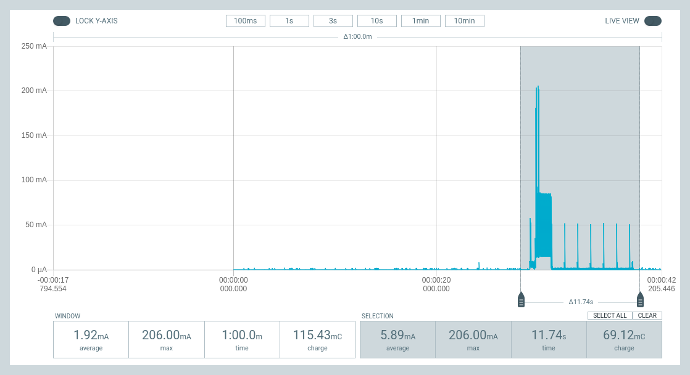
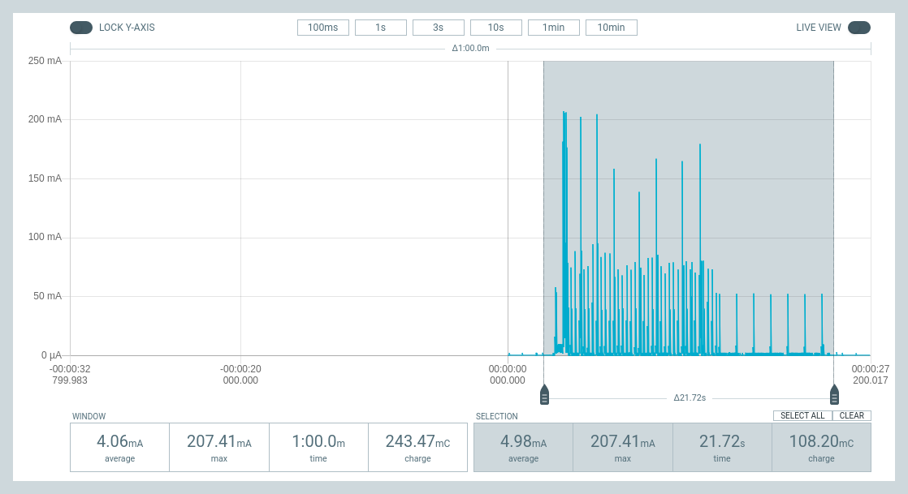
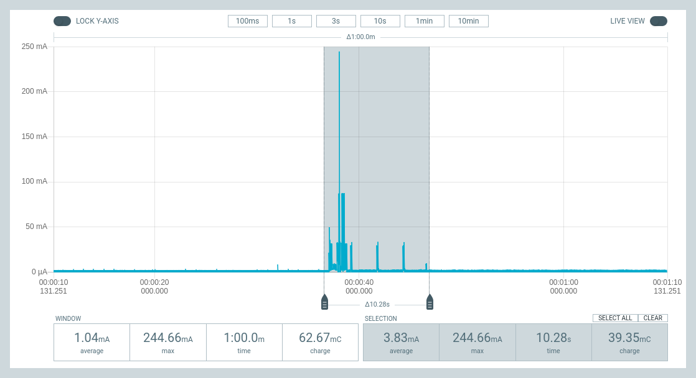
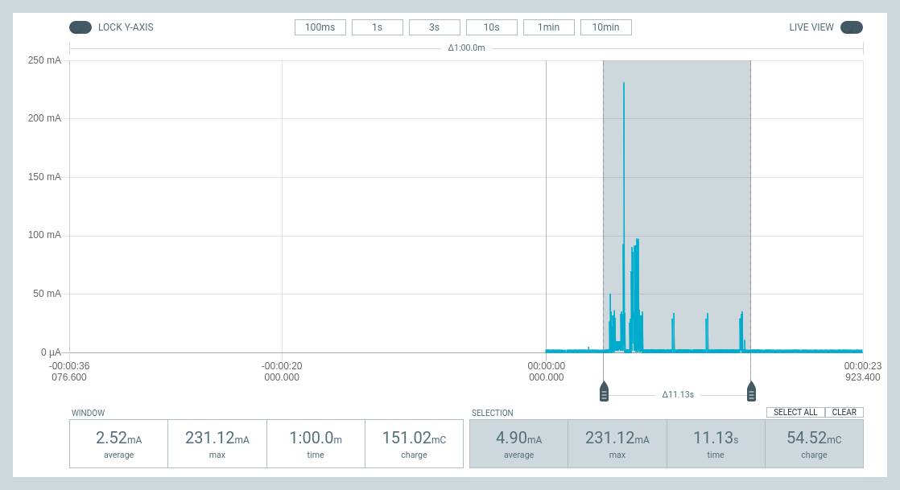

## Zephyr - Coaps Demo Client with TinyDtls

** !!! Under Construction !!! **

# Power Consumption

The measurements presented here are done using the [Nordic Semiconductor - Power Profiler Kit II (PPK2)](https://www.nordicsemi.com/Products/Development-hardware/Power-Profiler-Kit-2). Currently these measurements are done using the [nRF9160-DK](https://www.nordicsemi.com/Products/Development-hardware/nRF9160-DK) instead of the [Thingy:91](https://www.nordicsemi.com/Products/Development-hardware/Nordic-Thingy-91), mainly because the measurements with the DK could be done with plug-and-play.

The values for the `Thingy:91` are measurement replacing the battery with the PPK2 as source using about 4.1V. The previous test in June 2022 have been done with enabled UART and 3.3V. With that the device runs only for 56 days from battery. See [Powerconsumption-2022-06](POWERCONSUMPTION-2022-06.md).
Disabling the UART and the 3.3V results in quiescent current of 0.04 mA. Assuming a 80% efficiency and a battery of 1350 mAh, that results in 27000h (or about 1125 days) runtime without sending any data. 20x times more than without disabling the UART and the 3.3V. The self-discarge is unknown, but may reduce that time significantly.

## General Considerations for LTE-M/NB-IoT

Using LTE-M or NB-IoT for a power constraint device mostly comes with the requirement to enable power saving functions. This tests uses PSM (Power Sleeping Mode) and RAI (Release Assistance Indication), if available. eDRX was not considered.

As of summer 2022, in my setup only PSM works for both LTE-M and NB-IoT, RAI for NB-IoT.

With that, the usage to send data is split into two phases:
- network reregistration after PSM on wakeup
- exchanging messages

There are also other phases, which are not considered here:
- initial network registration (easiyl upto 3 minutes)
- wakeup with cell change
- wakeup changing from LTE-M to NB-IoT and visa versa

All these are taking randomly amount of time and may occur also unintended. So they hard to take into consideration. I guess, they unfortunately half the runtime in too many cases. 

## nRF9160-DK, LTE-M

**LTE-M Wakeup:**

This chart shows the frequently wakeup from PSM. Depending on the network provider, this happens every hour or at longer intervals. Without sending data, it depends mainly on the "active time", which is set to 8s for this test.

It takes about 12s, with an average current of 6mA at 5V. That results in 0.1 mWh per wakeup. A wakeup every hour reduces the runtime of a Thingy:91 then to 750 days.

**LTE-M Exchanging messages:**

This chart shows the complete power consumption of an message exchange (about 200 bytes request, 200 bytes response) including a wakeup from PSM. Additional to the wakeup itself, it depends on the message exchange (0,8s) and the time being "connected" (10s, without RAI, which is not availabel in my setup). The "active time", is set also to 8s for this test.

It takes about 22s, with an average current of 5mA at 5V. That results in 0.152 mWh. A message exchange every hour reduces the runtime of a Thingy:91 by 487 days to 637 days. If the message exchange is done piggybacked on a PSM wakeup (e.g. alive messages), then it reduces it only about 112 days, resulting 637 days as well. 

## nRF9160-DK, NB-IoT

**NB-IoT Wakeup:**

This chart shows the frequently wakeup from PSM. Depending on the network provider, this happens every hour or at longer intervals. Without sending data, it depends mainly on the "active time", which is set to 8s for this test.

Here it takes about 10s, but in my experience this sometimes takes up to 60s and more. Here an average current of 4mA at 5V is shown. That results in 0.055 mWh per wakeup. A wakeup every hour reduces the runtime of a Thingy:91 then to 880 days.

**NB-IoT Exchanging messages:**

This chart shows the complete power consumption of an message exchange (about 200 bytes request, 200 bytes response) including a wakeup from PSM. Additional to the wakeup itself, it depends on the message exchange (1,5s) and the time being "connected" (1s, with RAI). The "active time", is set also to 8s for this test.

It takes about 11s, with an average current of 5mA at 5V. That results in 0.076 mWh. A message exchange every hour reduces the runtime of a Thingy:91 about 310 days to 814 days. If the message exchange is done piggybacked on a PSM wakeup (e.g. alive messages), then it reduces it only about 66 days, also resulting in 814 days.  

## Thingy:91, LTE-M

**LTE-M Exchanging messages:**

This chart shows the complete power consumption of an message exchange (about 200 bytes request, 200 bytes response) including a wakeup from PSM. Additional to the wakeup itself, it depends on the message exchange (0,8s) and the time being "connected" (10s, without RAI, which is not availabel in my setup). The "active time", is set also to 8s for this test.

It takes about 22s, with an average current of 8.6mA at 4.1V. That results in 0.35 mWh. A message exchange every hour reduces the runtime of a Thingy:91 about 766 days, resulting in a theoretical runtime of 358 days.

We will see, how large the  self-discarge is and how many bugs will prevent proofing that timespan ;-).

## Sumup:

In my experiments, the first question is, which quiescent current does your device have itself. Only if that is low enough, the consumption of the reregistartion and message exchanges build the calculation base for the runtime. ["All theory is gray"](https://quotethedayaway.wordpress.com/2013/06/05/all-theory-is-gray-my-friend-but-forever-green-is-the-tree-of-life/), so I'm looking forward to complete my tooling, do the measurements for the Thingy:91 itself and then have a live-longterm-test run.

### Results of first longterm-tests - June 2022

See [Powerconsumption-2022-06](POWERCONSUMPTION-2022-06.md#results-of-first-longterm-tests-june-2022).

## Disclaimer

Other studies have other results. There are studies, which demonstrates the effect of the amount of data, there are studies, which use always a DTLS handshake for each couple of bytes. Using DTLS 1.2 CID doesn't require that handshake and my measurements shows a larger influence of the reregistration than the amount of bytes.

Anyway, feel asked to test the power consumption on your own. And, please, report your results.

** !!! Under Construction !!! **
