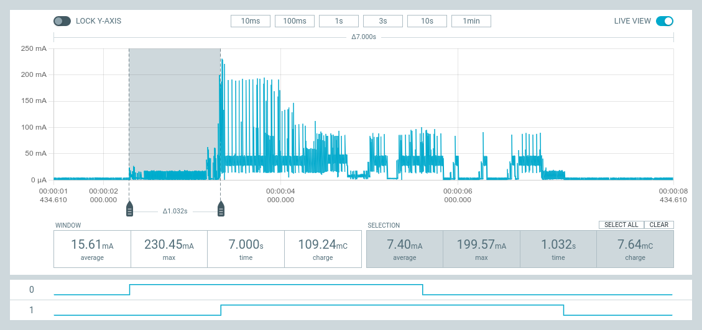
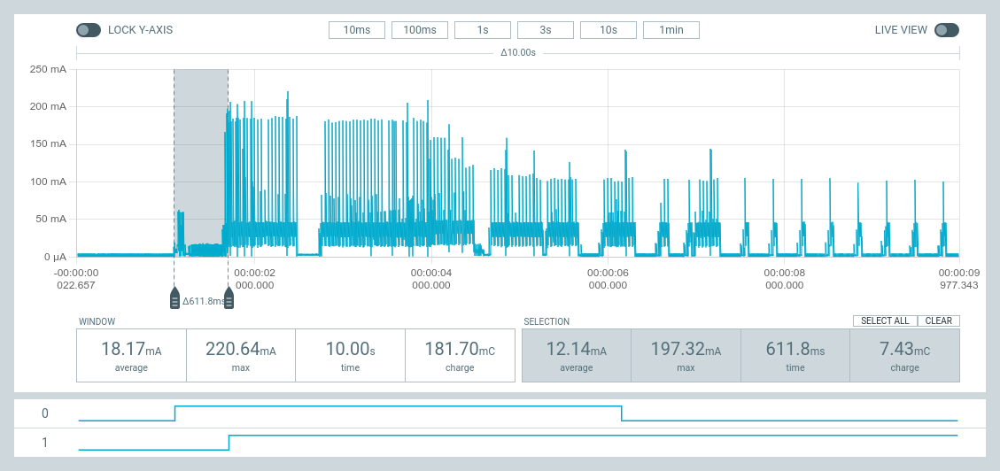
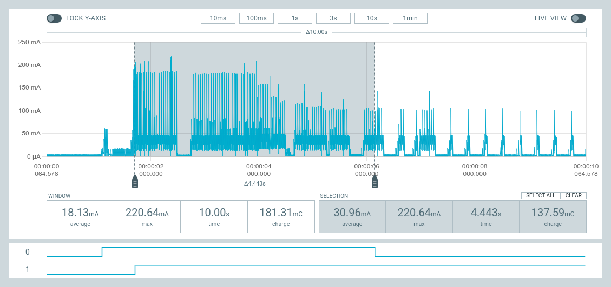
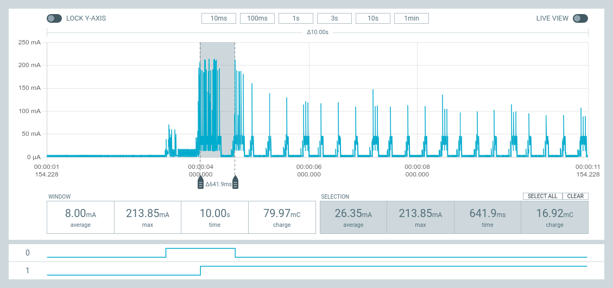
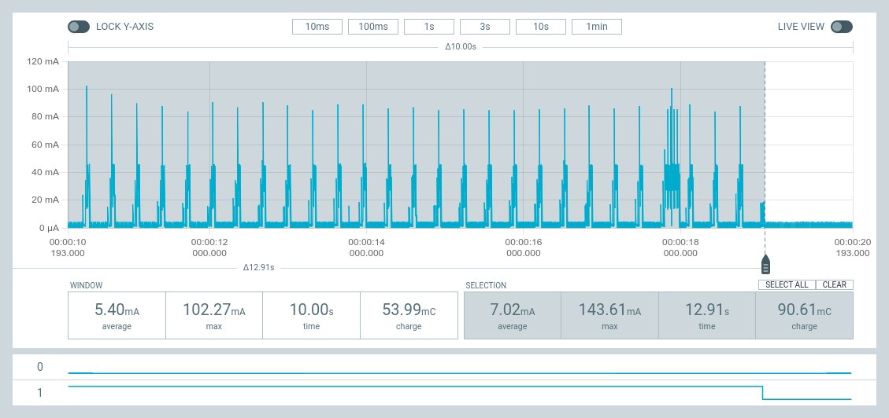
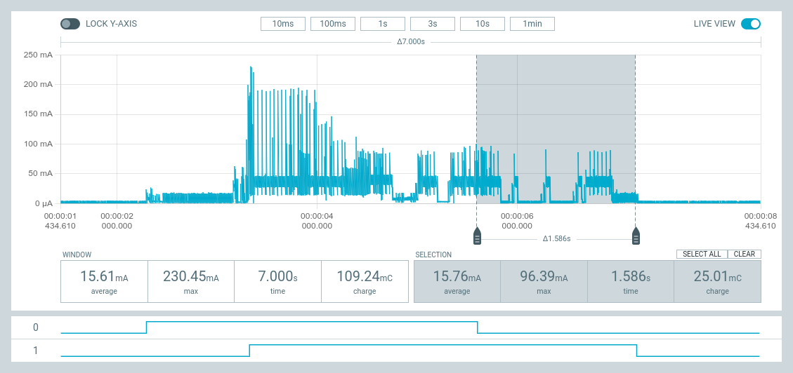
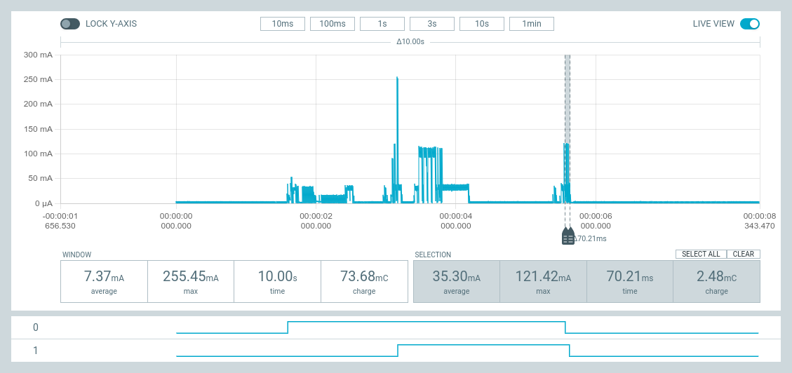

# Zephyr - Coaps Demo Client with Eclipse/TinyDtls

## Webinar "Power Consumption - IoT Protocols"

Version 0.5.99 (develop) - October 2022

## Supported Devices

| Only the [Nordic Semiconductor nRF9160-DK](https://www.nordicsemi.com/Products/Development-hardware/nRF9160-DK) is supported. |
| - |
|  |

The `nRF9160-DK` demo works with [ncs-2.1.0](https://github.com/nrfconnect/sdk-nrf/tree/v2.1.0).

Use the modem firmware [1.3.2](https://www.nordicsemi.com/-/media/Software-and-other-downloads/Dev-Kits/nRF9160-DK/nRF9160-modem-FW/mfw_nrf9160_1.3.2.zip).

## Required HW-Tools

In order to use this demo with your `nRF9160-DK`, you need:

- a `nRF9160-DK`
- a SIM card.
the `nRF9160-DK` is usually shipped with a SIM card. Check, if that covers your [area/country](https://www.nordicsemi.com/-/media/Software-and-other-downloads/3rd-party/iBasis-simplified-coverage-map-for-web.pdf). If not, you need a SIM card for your area/country.  (Sometimes the `nRF9160-DK` is shipped with an expired SIM card. Then you will need also an other one.) If you want to test both flavors, LTE-M and NB-IoT, you need a SIM card, which supports both.  
- a [Power Profiler Kit II](https://www.nordicsemi.com/Products/Development-hardware/Power-Profiler-Kit-2)

## Run It - Fast Track

Use [power_consumption_comparison_nrf9160dk_nrf9160_ns_full.hex](../../prebuild/power_consumption_comparison_nrf9160dk_nrf9160_ns_full.hex) and apply [Fast Track](../FASTTRACK.md)

## Build

Follow [Build](../../README.md#build) and apply 

```sh
west init --mr power_consumption_comparison -m https://github.com/boaks/zephyr-coaps-client.git zephyr-coaps-client
```

> **Note:** 
Please obey the `--mr power_consumption_comparison`.
Otherwise it will fail fetching the non existing "master" branch!

### Build & Flash

Use the [power-webinar-prj.conf](../../power-webinar-prj.conf) overlay to build the application.

```sh
west build -b nrf9160dk_nrf9160_ns --pristine -- -DOVERLAY_CONFIG="power-webinar-prj.conf"
```

and then flash that resulting firmware to your device

```sh
west flash
```

## Run It

After flashing, the `nRF9160-DK` starts to blink slow (LED1 and LED3) and after attaching to the mobile-network it switches to LED2. If the LEDs are switched off, the device is also connected with the plugtest-server of the [Eclipse/Californium Sandbox](https://github.com/eclipse-californium/californium#interop-server).

**Note:** If the `nRF9160-DK` starts for the first time in a new area, it may take longer (2-3 minutes) to connect to a mobile network. The `nRF9160-DK` saves then the configuration and the next time, the startup is much faster, if the `nRF9160-DK` is not relocated too far.

Press the `nRF9160-DK`'s button 1. The LED3 should start and LED2 follows very fast. If it is re-attached at the mobile-network, it switches to LED2 only. And if the response from the server is received, the LED switches off again. On error, the LED1 is switched on. Usually it takes all together 1 second (LTE-M/CAT-M1) and only 2 ip-messages are exchanged.

The demo supports several modes, detected on restart:

| Input | Position | Function |
| :---- | - | ------ |
| Switch 1 | GND | use modem power on/off |
| | N.C. | use PSM |
| Switch 2 | GND | use https |
| | N.C. | use coaps |
| Button 1 | Pressed | force LTE-M |
| Button 2 | Pressed | force NB-IoT |
| No button | | Auto select, preference LTE-M |

To apply, switch the positions, press a button and hold it. Then click on the reset-button wait until the LEDs switching on before release the button.

## Charts

Slide 7, LTE-M, full-attach



Slide 7, LTE-M, re-attach



Slide 9, LTE-M, https request



Slide 9, LTE-M, coaps request (DTLS 1.2 CID)



Slide 14, LTE-M, PSM switching to sleep



Slide 14, LTE-M, switching modem off



Slide 14, NB-IoT, PSM with RAI


